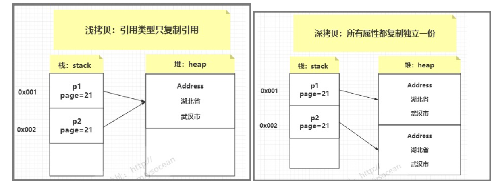

# `Assert`关键字

IDEA中默认`assert`(断言)是关闭，开启方式如下：

简单来说：就是设置一下`jvm`的参数，参数是`-enableassertions`或者`-ea`（推荐）


`assert [boolean 表达式]`

- 如果[boolean表达式]为true，则程序继续执行。
- 如果为false，则程序抛出AssertionError，并终止执行。

`assert [boolean 表达式 : 错误表达式 （日志）]`

- 如果[boolean表达式]为true，则程序继续执行。
- 如果为false，则程序抛出java.lang.AssertionError，输出[错误信息]。

```java
int a = 1;
int b = 2;
assert a > b : "错误，a不大于b";
```


# Character.*isLetterOrDigit*

# 位运算

在Java中，整数的表示方式涉及到原码、补码和反码。 

## 原码

原码表示方式中，最高位（符号位）表示数的正负，0表示正数，1表示负数。

其余位表示数的绝对值，以二进制形式表示。

例如，正数+5的原码为 `00000101`，负数-5的原码为 `10000101`。

## 反码

反码是将原码中的正数保持不变，负数的反码是在原码的基础上，符号位不变，其余位取反。

## 补码

补码是在反码的基础上，对负数进行加1操作得到的表示方式。

正数的补码就是其本身；

**补码表示方式是计算机中最常用的表示负数的方法，它能够解决原码和反码相加时的溢出问题。**

## 对比

原码最直观，符号位直接表示正负，但在运算中存在问题。在加减法时，需要对符号位数值位分别进行处理，运算逻辑复杂。此外，存在正0和负0的问题。

反码解决了加法问题，但是运算过程仍然需要对符号位单独处理，也存在正0和负0的问题。

补码统一了正负数的表示，补码中只需进行逐位相加，不需要单独处理符号位和进位。补码中不存在正零和负零的表示问题，只有一个零。

## 位运算符

### &

两个操作数对应位同为1时，结果为1，其余全为0（或者是只要有一个操作数为0，结果就为0）。

### |

两个操作数对应位同为0时，结果为0，其余全为1（或者是只要有一个操作数为1，结果就为1）。

### ~

按位非：按位取反

5的2进制表示（假设只用4比特表示，最高比特为符号位）是0101，0101按位取反后是1010。1010是补码，取反（符号位不变）加1后就是原码。取反后是1101，加1后是1110（是10进制的-6），所以~5等于-6。

### ^

按位异或：第一个操作数的第n位与第二个操作数的第n位不同，结果为1，否则为0。

### <<

左移运算符

符号位不变，低位补0。移几位补几个0。正数或者负数左移，低位都是用0补。

5<<2=20

0000 0000 0000 0000 0000 0000 0000 0101 左移2位，低位补0：

0000 0000 0000 0000 0000 0000 0001 0100 换算成10进制为20

### \>>

右移运算符

如果值为正，则在高位补0，如果值为负，则在高位补1.

5换算成二进制： 0000 0000 0000 0000 0000 0000 0000 0101
-5换算成二进制： 1111 1111 1111 1111 1111 1111 1111 1011

5右移3位后： 0000 0000 0000 0000 0000 0000 0000 0000 
-5右移3位后：   1111 1111 1111 1111 1111 1111 1111 1111

-5>>3 = -1

5>>3 = 0

### \>>>

无符号右移运算符

无符号的意思是将符号位当作数字位看待。即无论值的正负，都在高位补0.


# 浅拷贝&深拷贝

**首先需要清楚深拷贝/浅拷贝是针对Object或者Array这样的引用数据类型而言的。**

在java中`=`做赋值操作时，对于基本数据类型，实际上是拷贝了其值，对于对象而言，则是复制了该对象的引用，也就是指向的还是同一个对象。

**浅拷贝的定义**：只对基本数据类型进行了拷贝，而对引用数据类型只是进行了引用的传递，而没有创建一个新的对象。

**深拷贝的定义**：创建一个新对象，然后将当前对象的非静态字段复制到该新对象，无论该字段是值类型的还是引用类型，都复制独立的一份。当你修改其中一个对象的任何内容时，都不会影响另一个对象的内容。

**总结一下就是不论深浅拷贝，都对基本数据类型进行了值传递，对引用数据类型，浅拷贝是引用传递般的拷贝，而深拷贝则会创建一个新的对象。**



数据分为基本数据类型(int, boolean, double, byte, char等)和对象数据类型。

基本数据类型会直接存储在栈中，而引用数据类型则是，在栈中存储对象的引用，在堆中存储真实的数据。引用数据类型在栈中存储了指针，该指针指向堆中该实体的起始地址。当解释器寻找引用值时，会首先检索其在栈中的地址，取得地址后从堆中获得实体。


对于对象用`"="` 赋值 其实只是引用指针的复制,这两个引用还是指向同一个对象。

以下就是一个案例：

```java
        Person p1 = new Person("bob", 10);
        Person p2 = p1;

        p2.setAge(14);
        System.out.println(p1.getAge());//14
        p2.setName("aka");
        System.out.println(p1.getName());//aka
```


对于Person要实现深拷贝，那么被复制的类要实现Cloneable接口，


## **clone()**方法

在Java中，`clone()`是一个用于对象复制的方法，它用于创建当前对象的副本。这个方法是在`Object`类中定义的，因此所有的Java类都可以调用它。 

当一个对象调用`clone()`方法时，它会创建并返回该对象的一个副本。这个副本是一个独立的对象，与原始对象具有相同的状态和数据。

**调用对象的 clone 方法，必须要让对应的类实现 Cloneable 接口，并且覆写 clone 方法。**

一般而言，clone（）方法满足：

- 对任何的对象x，都有`x.clone() !=x`//克隆对象与原对象不是同一个对象
- 对任何的对象x，都有x.clone().getClass()= =x.getClass()//克隆对象与原对象的类型一样
- 如果对象x的equals()方法定义恰当，那么x.clone().equals(x)应该成立。

```java
		Person p1 = new Person("bob", 10);
        Person p2 = (Person) p1.clone();
        /**
         * 已经是两个不同的对象了
         */
        System.out.println(p1);//Person@6debcae2
        System.out.println(p2);//Person@5ba23b66
        p2.setAge(14);
        p2.setName("can");
        System.out.println(p1.printInfo());//name:bob age:10
        System.out.println(p2.printInfo());//name:can age:14
```

如此就已经实现了深拷贝，但有一个问题，**如果该对象中含有对象，这个对象依然是浅拷贝。**

```java
		Address address = new Address("LA");
        Person p1 = new Person("bob", 10,address);
        Person p2 = (Person) p1.clone();
        p1.address.setCity("GS");
        p2.address.setCity("MIA");
        System.out.println(p1.printInfo());//name:bob age:10 address:MIA
        System.out.println(p2.printInfo());//name:bob age:10 address:MIA
```

虽然Student是实现了深拷贝，但Address却还是浅拷贝，也需要重写Address类的clone方法

```java
	/**
     * 重写Person中的clone方法
     */
	@Override
    protected Object clone() throws CloneNotSupportedException {
        Person p = (Person) super.clone();
        p.address = (Address) address.clone();
        return p;
    }
```

```java
		Address address = new Address("LA");
        Person p1 = new Person("bob", 10,address);
        Person p2 = (Person) p1.clone();
        p1.address.setCity("GS");
        p2.address.setCity("MIA");
        System.out.println(p1.printInfo());//name:bob age:10 address:GS
        System.out.println(p2.printInfo());//name:bob age:10 address:MIA
```

## 序列化实现深拷贝

以上clone方法在遇到类中有其他对象的引用时，需要重写许多的clone方法，非常的麻烦，可以采用序列化的方式实现深拷贝。**因为序列化产生的是两个完全独立的对象，所有无论嵌套多少个引用类型，序列化都是能实现深拷贝的。**

**为了实现深拷贝，需要确保被复制的对象及其所有引用对象都实现了`Serializable`接口**

```java
		Person originalPerson = new Person("Alice", 25);
        try {
            // 将原始对象序列化到字节数组输出流中
            ByteArrayOutputStream baos = new ByteArrayOutputStream();
            ObjectOutputStream oos = new ObjectOutputStream(baos);
            oos.writeObject(originalPerson);
            oos.close();

            // 从字节数组输入流中反序列化出新的对象
            ByteArrayInputStream bais = new ByteArrayInputStream(baos.toByteArray());
            ObjectInputStream ois = new ObjectInputStream(bais);
            Person clonedPerson = (Person) ois.readObject();
            ois.close();

            // 修改克隆对象的值
            clonedPerson.setName("Bob");
            clonedPerson.setAge(30);

            // 输出原始对象和克隆对象的值
            System.out.println(originalPerson.printInfo());//name:Alice age:25
            System.out.println(clonedPerson.printInfo());//name:Bob age:30
        } catch (IOException | ClassNotFoundException e) {
            e.printStackTrace();
        }
```

## 数组的拷贝

手动创建新数组并逐个复制元素：通过创建一个新数组，并逐个复制原始数组的元素到新数组中，可以实现深拷贝。这种方式适用于任何类型的数组。


数组要使用clone方法则是浅拷贝，修改克隆数组中的元素并不会影响原始数组的值。然而，如果原始数组是一个对象数组，那么对象的引用仍然会被共享，因此在克隆数组和原始数组中修改对象的属性会相互影响。

```java
		int a[] = {1, 2, 3};
        int[] b = a.clone();
        b[1] = 1;
        Arrays.stream(a).forEach(System.out::println);//1 2 3
        Arrays.stream(b).forEach(System.out::println);//1 1 3
```

这个例子是：**基本数据类型上面已经说过它没有深浅拷贝这个概念，可以把他理解成只有深拷贝。**


`Arrays.copyOf()`也是 Java 中用于复制数组并创建一个新数组的方法。与 `clone()` 方法不同，`Arrays.copyOf()` 执行的是深拷贝（Deep Copy），即复制数组中的元素本身而不是仅仅复制引用。

*该方法从原始数组的第一个元素开始复制，直到长度为 newLength，如果原始数组长度大于 newLength，则只截取 [0 ～ maxLength-1] 的部分，如果小于的话，则其余部分用 0 填充。*

```
		//1、基本数据类型
        int a[] = {1, 2, 3};
        int[] b = Arrays.copyOf(a,a.length);
        b[1] = 1;
        Arrays.stream(a).forEach(System.out::println);//1 2 3
        Arrays.stream(b).forEach(System.out::println);//1 1 3
 
        //2、对象数组
        Student[]  stus = {new Student("a", 3, "女"),new Student("b", 29, "男"),new Student("c", 27, "女")};
        Student[] copyStuArr = Arrays.copyOf(stus,stus.length);
        copyStuArr[0].setName("d");
        copyStuArr[1].setAge(1);
        System.out.println(Arrays.toString(stus));//[d-3-女, b-1-男, c-27-女]
        System.out.println(Arrays.toString(copyStuArr));//[d-3-女, b-1-男, c-27-女]
```

可以看出`Arrays.copyOf()`为浅拷贝。
