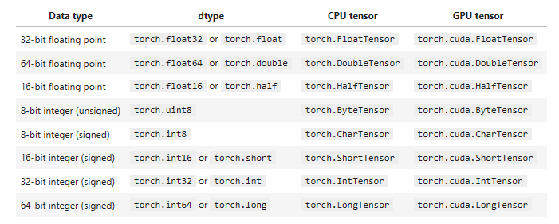
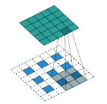
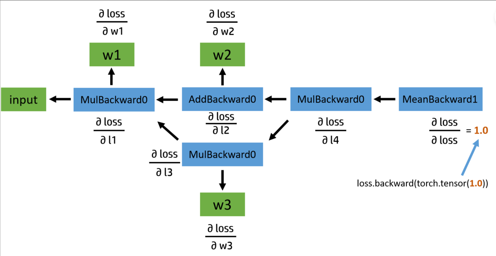

# 1

## torch

`torch.set_default_tensor_type(t)`

```python
import torch

# 设置默认张量类型为GPU上的浮点型张量
torch.set_default_tensor_type(torch.cuda.FloatTensor)

# 创建一个默认类型的张量
a = torch.randn(3, 3)
print(a.type())  # 输出为torch.cuda.FloatTensor

# 创建一个CPU上的张量
b = torch.randn(3, 3).cpu()
print(b.type())  # 输出为torch.FloatTensor

# 再次创建一个默认类型的张量
c = torch.randn(3, 3)
print(c.type())  # 输出为torch.cuda.FloatTensor

```


`torch.numel(input)->int`

```python
a = torch.randn(3, 4)
print(a)  # 输出张量的值
print(torch.numel(a))  # 输出张量中元素的总数 12
print(a.shape)  # 输出张量的形状
print(a.size())  # 输出张量的形状
print(a.numel())  # 输出张量中元素的总数
```


`torch.set_printoptions(precision=None, threshold=None, edgeitems=None, linewidth=None, profile=None)`

设置打印张量时的格式和精度。它的参数是一系列关键字参数，可以用来设置不同的选项。

- precision：设置打印浮点数的精度，默认为8位。
- threshold：设置打印张量时省略的元素数量，默认为1000。
- edgeitems：设置打印张量时显示的边缘元素数量，默认为3。
- linewidth：设置打印张量时每行的字符数，默认为80


## 创建Tensor的多种方法

### 指定形状创建

```python
a = torch.Tensor(2, 3)
```

### 使用numpy创建

```python
a = np.array([1, 2, 3, 4])
a_t = torch.from_numpy(a)  # tensor([1, 2, 3, 4], dtype=torch.int32)
```

### 使用list创建

```python
a = torch.tensor([1, 2])  # tensor([1, 2])
```

尽量避免此方式，易与给定shape的创建方式混淆

### 指定维度初始化tensor

```python
a = torch.empty(2, 3)
b = torch.FloatTensor(2, 3)
c = torch.IntTensor(2, 3)
```

### 其他

```python
a = torch.full([2, 2], 1)
'''
tensor([[1, 1],
        [1, 1]])
'''
b = torch.arange(10)  # tensor([0, 1, 2, 3, 4, 5, 6, 7, 8, 9])
c = torch.zeros(2, 2)  # 全0
d = torch.ones(3,4)  # 全1

e = torch.rand([2,2]) # 0-1之间
'''
tensor([[0.2412, 0.4670],
        [0.1417, 0.1466]])
'''
f = torch.randn([2,3])  # 标准正态分布
g = torch.normal(mean=1,std=0.1,size=[2,3])  # 离散正态分布
'''
tensor([[0.8254, 0.9837, 0.9440],
        [0.9903, 1.1456, 1.0187]])
'''
h = torch.linspace(start=1,end=10,steps=6)
# tensor([ 1.0000,  2.8000,  4.6000,  6.4000,  8.2000, 10.0000])

k = torch.randperm(5)  # tensor([4, 0, 2, 3, 1])

j = torch.eye(3)
```

### Tensor-tensor

在Pytorch中，Tensor和tensor都用于生成新的张量。

Tensor是python类，是torch.FloatTensor()的别名，torch.Tensor([1,2]) 会调用Tensor类的构造函数\__init__，生成单精度浮点类型的张量。

torch.tensor()仅仅是Python的函数,其中data可以是：list, tuple, array, scalar等类型。torch.tensor()可以从data中的数据部分做拷贝（而不是直接引用），根据原始数据类型生成相应的torch.LongTensor，torch.FloatTensor，torch.DoubleTensor。

```python
"""使用Tensor函数新建tensor是最复杂多变的方式，它既可以接收一个list，
并根据list的数据新建tensor，也能根据指定的形状新建tensor，还能传入其他的tensor"""
print(torch.Tensor([2,3]))  # tensor([2., 3.])
print(torch.Tensor((2,3)))  # tensor([2., 3.])
b = torch.Tensor(a.size())
c = torch.Tensor(b)  # 修改c同时会修改b
```

## Tensor的操作

```python
a = torch.rand(2,3)
print(a.size())  # torch.Size([2, 3])
print(a.numel())  # 6
print(a.shape)  # torch.Size([2, 3])


a = torch.arange(0, 6)
b = a.view(3, -1)  # 修改b中的值，a中的值也跟着改变
"""尽量使用reshape"""
e = torch.arange(0,16).reshape(4,4)


# 创建一个形状为(2,2)的张量
a = torch.ones(2, 2)
b = a.unsqueeze(dim=1)  # torch.Size([2, 1, 2])
c = a.unsqueeze(dim=0)  # torch.Size([1, 2, 2])
# 在原来的张量上增加一个维度
a.unsqueeze_(dim=1)
print(a)
d = a.squeeze()  # 把所有维度为“1”的压缩，或者指定压缩某一维度的1


'''
resize是另一种可用来调整size的方法，但与view不同，它可以修改tensor的大小。
如果新大小超过了原大小，会自动分配新的内存空间，而如果新大小小于原大小，则之前的数据依旧会被保存
'''
b.resize_(1, 3)  # tensor([[0, 1, 2]])
b.resize_(3, 3)
'''
tensor([[0, 1, 2],
        [3, 4, 5],
        [0, 0, 0]])
'''


d = torch.rand(3, 4)
print(d[0:1, :2])
print(d[0, :2])
'''
注意区别：
tensor([[0.5203, 0.2636]])
tensor([0.5203, 0.2636])
'''


a = torch.ones(2, 2)
c = torch.cat((a, a), dim=1)
d = torch.cat((a, a), dim=0)
print(c)
'''
tensor([[1., 1., 1., 1.],
        [1., 1., 1., 1.]])
'''
print(d)
'''
tensor([[1., 1.],
        [1., 1.],
        [1., 1.],
        [1., 1.]])
'''
e, f = torch.chunk(c, chunks=2,dim=0)
print(e)
print(f)
'''
tensor([[1., 1., 1., 1.]])
tensor([[1., 1., 1., 1.]])
'''
```


|              函数               |                         功能                          |
| :-----------------------------: | :---------------------------------------------------: |
| index_select(input, dim, index) |      在指定维度dim上选取，比如选取某些行、某些列      |
|   masked_select(input, mask)    |       例子如上，a[a>0]，使用ByteTensor进行选取        |
|         non_zero(input)         |                     非0元素的下标                     |
|    gather(input, dim, index)    | 根据index，在dim维度上选取数据，输出的size与index一样 |

`tensor.new()`

创建一个新的Tensor，该Tensor的type和device都和原有Tensor一致，且无内容。

```python
a = torch.randn(2, 3)
b = a.new()
b = torch.Tensor.new(a)
```


`tensor.expand() `

- 只能对维度值包含 1 的张量Tensor进行扩展，即：Tensor的size必须满足：torch.Size([1, n]) 或者 torch.Size([n, 1]) 。
- 只能对维度值等于 1 的那个维度进行扩展，无需扩展的维度务必保持维度值不变，或者置为-1，否则，报错。（简言之，只要是单维度均可进行扩展，但是若非单维度会报错。）
- 扩展的Tensor不会分配新的内存，只是原来的基础上创建新的视图并返回
- 新扩展维度的取值范围为：− 1 以 及 [ 1 , + ∞ ] 区 间 内 的 任 意 整 数 -1以及[1, +∞]区间内的任意整数−1以及[1,+∞]区间内的任意整数，例如：将 torch.Size([1, n]) 扩展为torch.Size([m, n])时，新扩展维度 m 的可能取值为-1，或者 m ≥ 1的任意整数；
- 只能对张量Tensor进行维度扩展，而不能降维；否则，报错。
- tensor通过.expand()函数扩展某一维度后，tensor自身不会发生变化

```python
a = torch.tensor([[1],[2],[3]])

b = a.expand(-1,3)
'''
tensor([[1, 1, 1],
        [2, 2, 2],
        [3, 3, 3]])
'''
c = torch.tensor([1,2,3])

d = c.expand(2,-1)
'''
tensor([[1, 2, 3],
        [1, 2, 3]])
'''
```

`tensor.expand_as()`

```python
a = torch.tensor([[2], [3], [4]])
b = torch.tensor([[2, 2], [3, 3], [5, 5]])
c = a.expand_as(b)
'''
tensor([[2, 2],
        [3, 3],
        [4, 4]])
'''
```

### 高级索引

```python
x = t.arange(0,27).view(3,3,3)

x[[1, 2], [1, 2], [2, 0]] # x[1,1,2]和x[2,2,0]
x[[2, 1, 0], [0], [1]] # x[2,0,1],x[1,0,1],x[0,0,1]
x[[0, 2], ...] # x[0] 和 x[2]
```


### 元素操作

|              函数               |                 功能                  |
| :-----------------------------: | :-----------------------------------: |
| abs/sqrt/div/exp/fmod/log/pow.. |  绝对值/平方根/除法/指数/求余/求幂..  |
|    cos/sin/asin/atan2/cosh..    |             相关三角函数              |
|     ceil/round/floor/trunc      | 上取整/四舍五入/下取整/只保留整数部分 |
|     clamp(input, min, max)      |         超过min和max部分截断          |
|          sigmod/tanh..          |               激活函数                |

PyTorch都实现了运算符重载，可以直接使用运算符。如`a ** 2` 等价于`torch.pow(a,2)`, `a * 2`等价于`torch.mul(a,2)`。

### 归并操作

|         函数         |        功能         |
| :------------------: | :-----------------: |
| mean/sum/median/mode | 均值/和/中位数/众数 |
|      norm/dist       |      范数/距离      |
|       std/var        |     标准差/方差     |
|    cumsum/cumprod    |      累加/累乘      |

以上大多数函数都有一个参数`dim`，用来指定这些操作是在哪个维度上执行的。关于dim(对应于Numpy中的axis)的解释众说纷纭，这里提供一个简单的记忆方式：

假设输入的形状是(m, n, k)

- 如果指定dim=0，输出的形状就是(1, n, k)或者(n, k)
- 如果指定dim=1，输出的形状就是(m, 1, k)或者(m, k)
- 如果指定dim=2，输出的形状就是(m, n, 1)或者(m, n)

size中是否有"1"，取决于参数`keepdim`，`keepdim=True`会保留维度`1`

```python
a = torch.ones(3,2)
a.sum(dim=0,keepdim=True)  # tensor([[3., 3.]])
```

### 比较

|       函数        |                 功能                  |
| :---------------: | :-----------------------------------: |
| gt/lt/ge/le/eq/ne | 大于/小于/大于等于/小于等于/等于/不等 |
|       topk        |              最大的k个数              |
|       sort        |                 排序                  |
|      max/min      |       比较两个tensor最大最小值        |

表中第一行的比较操作已经实现了运算符重载，因此可以使用`a>=b`、`a>b`、`a!=b`、`a==b`，其返回结果是一个`ByteTensor`，可用来选取元素。max/min这两个操作比较特殊，以max来说，它有以下三种使用情况：

- t.max(tensor)：返回tensor中最大的一个数
- t.max(tensor,dim)：指定维上最大的数，返回tensor和下标
- t.max(tensor1, tensor2): 比较两个tensor相比较大的元素

### 线性代数操作

|               函数               |               功能                |
| :------------------------------: | :-------------------------------: |
|              trace               |     对角线元素之和(矩阵的迹)      |
|               diag               |            对角线元素             |
|            triu/tril             | 矩阵的上三角/下三角，可指定偏移量 |
|              mm/bmm              |     矩阵乘法，batch的矩阵乘法     |
| addmm/addbmm/addmv/addr/badbmm.. |             矩阵运算              |
|                t                 |               转置                |
|            dot/cross             |             内积/外积             |
|             inverse              |             求逆矩阵              |
|               svd                |            奇异值分解             |

需要注意的是，矩阵的转置会导致存储空间不连续，需调用它的`.contiguous`方法将其转为连续。

```python
b = a.t()
b.is_contiguous()
```

### tensor.bmm&tensor.mm&torch.matmul&torch.mul

[torch.bmm()函数解读](https://blog.csdn.net/qq_40178291/article/details/100302375)

[pytorch中tensor.mul()和mm()和matmul()](https://blog.csdn.net/qq_42368281/article/details/121382172)

## Tensor类型




各数据类型之间可以互相转换，`type(new_type)`是通用的做法，同时还有`float`、`long`、`half`等快捷方法。CPU tensor与GPU tensor之间的互相转换通过`tensor.cuda`和`tensor.cpu`方法实现，此外还可以使用`tensor.to(device)`

```python
# 设置默认tensor，注意参数是字符串
torch.set_default_tensor_type('torch.DoubleTensor')
a = torch.Tensor(2,3)  # 现在a是DoubleTensor,dtype是float64
b = a.float()  # 把a转成FloatTensor，等价于b=a.type(torch.FloatTensor)
```

## Tensor底层存储

tensor分为头信息区(Tensor)和存储区(Storage)，信息区主要保存着tensor的形状（size）、步长（stride）、数据类型（type）等信息，而真正的数据则保存成连续数组。由于数据动辄成千上万，因此信息区元素占用内存较少，主要内存占用则取决于tensor中元素的数目，也即存储区的大小。

一般来说一个tensor有着与之相对应的storage, storage是在data之上封装的接口，便于使用，而不同tensor的头信息一般不同，但却可能使用相同的数据。绝大多数操作并不修改tensor的数据，而只是修改了tensor的头信息。这种做法更节省内存，同时提升了处理速度。在使用中需要注意。 此外有些操作会导致tensor不连续，这时需调用`tensor.contiguous`方法将它们变成连续的数据，该方法会使数据复制一份，不再与原来的数据共享storage。

## requires_grad

当我们创建一个张量 (tensor) 的时候，如果没有特殊指定的话，那么这个张量是默认是**不需要**求导的。我们可以通过 `tensor.requires_grad` 来检查一个张量是否需要求导。

在张量间的计算过程中，如果在所有输入中，有一个输入需要求导，那么输出一定会需要求导；相反，只有当所有输入都不需要求导的时候，输出才会不需要。

我们在pytorch构建神经网络时，我们的输入数据以及target都是不设置`requires_grad的，因为我们构建的model所有参数是默认求导的，因此，网络的输出一定是需要求导的。我们的网络参数其实也是可以设置为不求导的，这一点是有很大用处的，例如迁移学习中，将一个预训练好的模型冻结一部分网络参数，这些层的参数在训练过程中就不再更新，只更新我们设置的fc层的参数。

```python
model = torchvision.models.resnet18(pretrained=True)
for param in model.parameters():
    param.requires_grad = False

# 用一个新的 fc 层来取代之前的全连接层
# 因为新构建的 fc 层的参数默认 requires_grad=True
model.fc = nn.Linear(512, 100)

# 只更新 fc 层的参数
optimizer = optim.SGD(model.fc.parameters(), lr=1e-2, momentum=0.9)

# 通过这样，我们就冻结了 resnet 前边的所有层，
# 在训练过程中只更新最后的 fc 层中的参数。
```

## torch.no_grad()

当我们对模型进行验证时，无需计算模型参数的导数，可以将这部分代码放在`with torch.no_grad():` 之中，减少可能存在的计算以及内存消耗。

## CPU and GPU

`tensor.cuda()` 和 `tensor.to(device)`这二者在设备为GPU时，没有什么区别，但是后者较为方便。我们在代码首部指定设备就可以直接使用了：

```python
device = torch.device("cuda") if torch.cuda.is_available() else torch.device("cpu")

a = torch.rand([3,3]).to(device)
```

但是在GPU上的张量，要转为numpy是需要将张量先转换到CPU上的，**因为Numpy 是 CPU-only 的**。

```python
x = torch.rand([3, 3], device='cuda')
x_ = x.cpu().numpy()
"""当需要对一个要求求导的张量转换numpy时，一定要先取到一个数据副本再转为numpy"""
y = torch.rand([3, 3], requires_grad=True, device='cuda')
y_ = y.cpu().detach().numpy()
```


## .detach()&.data&.item()

Tensor.data和Tensor.detach()一样， 都会返回一个新的Tensor， 这个Tensor和原来的Tensor共享内存空间，一个改变，另一个也会随着改变，且都会设置新的Tensor的requires_grad属性为False。现在.data仍保留，但建议使用 .detach()。


```python
'''以下是.data'''
a = torch.tensor([1, 2, 3.], requires_grad=True)
out = a.sigmoid()
c = out.data  
# 需要注意的是，通过.data “分离”得到的的变量会和原来的变量共用同样的数据，而且新分离得到的张量是不可求导的，c发生了变化，原来的张量也会发生变化
c.zero_()  # 改变c的值，原来的out也会改变
print(c.requires_grad)  # False
print(c)  # tensor([0., 0., 0.])
print(out.requires_grad)  # True
print(out)  # tensor([0., 0., 0.], grad_fn=<SigmoidBackward0>)
out.sum().backward()
print(a.grad)  # tensor([0., 0., 0.])

'''以下是.detach()'''
a = torch.tensor([1, 2, 3.], requires_grad=True)
out = a.sigmoid()
c = out.detach()  
# 需要走注意的是，通过.detach() “分离”得到的的变量会和原来的变量共用同样的数据，而且新分离得到的张量是不可求导的，c发生了变化，原来的张量也会发生变化
c.zero_()  # 改变c的值，原来的out也会改变
print(c.requires_grad)  # False
print(c)  # tensor([0., 0., 0.])
print(out.requires_grad)  # True
print(out)  # tensor([0., 0., 0.], grad_fn=<SigmoidBackward0>)
out.sum().backward()
print(a.grad)  # 运行此处会报错
'''
由于我更改分离之后的变量值c,导致原来的张量out的值也跟着改变了，
这个时候如果依然按照求导规则来求导，由于out已经更改了，所以不会再继续求导了，
而是报错，这样就避免了得出完全牛头不对马嘴的求导结果。
'''
```

Tensor.data和Tensor.detach()一样， 都会返回一个新的Tensor， 这个Tensor和原来的Tensor共享内存空间，一个改变，另一个也会随着改变，且都会设置新的Tensor的requires_grad属性为False。这两个方法只取出原来Tensor的tensor数据， 丢弃了grad、grad_fn等额外的信息。区别在于**Tensor.data不能被autograd追踪到，如果你修改了Tensor.data返回的新Tensor，原来的Tensor也会改变， 但是这时候的微分并没有被追踪到，那么当你执行loss.backward()的时候并不会报错，但是求的梯度就是错误的**！因此， 如果你使用了Tensor.data，那么切记一定不要随便修改返回的新Tensor的值。如果你使用的是Tensor.detach()方法，当你修改他的返回值并进行求导操作，会报错。 因此，**Tensor.detach()是安全的。**


BTW,  .data返回的是一个tensor,而.item()返回的是一个具体的数值。注意：对于元素不止一个的tensor列表，使用item()会报错。如果想把含多个元素的 tensor 转换成 Python list 的话，要使用 `tensor.tolist()`。

```python
x  = torch.randn(1, requires_grad=True, device='cuda')
print(x)
# tensor([-0.4717], device='cuda:0', requires_grad=True)

y = x.item()
print(y, type(y))
# -0.4717346727848053 <class 'float'>

x = torch.randn([2, 2])
y = x.tolist()
print(y)
```

## tensor.copy_&tensor.clone

创建一个tensor与源tensor有相同的shape，dtype和device，不共享内存地址，但新tensor的梯度会叠加在源tensor上。总之就是不共享内存，两个tensor的值无联系，但是梯度有联系。（应该把clone()理解成一个“函数”，而不能把b理解成一个完全独立的节点。）

```python
a = torch.tensor([1.,2.,3.],requires_grad=True)
b = a.clone()

print(a.data_ptr()) # 3004830353216
print(b.data_ptr()) # 3004830353344 内存地址不同

print(a) # tensor([1., 2., 3.], requires_grad=True)
print(b) # tensor([1., 2., 3.], grad_fn=<CloneBackward>)  复制成功
print('-'*30)

c = a * 2
d = b * 3

c.sum().backward() 
print(a.grad) # tensor([2., 2., 2.])

d.sum().backward() 
print(a.grad) # tensor([5., 5., 5.]) # 源tensor的梯度叠加了新tensor的梯度
print(b.grad) # None # 此时复制出来的节点已经不属于叶子节点，因此不能直接得到其梯度
```

copy\_()函数完成与clone()函数类似的功能，但也存在区别。调用copy\_()的对象是目标tensor，参数是复制操作from的tensor，最后会返回目标tensor；而clone()的调用对象为源tensor，返回一个新tensor。当然clone()函数也可以采用torch.clone()调用，将源tensor作为参数。

copy\_()函数的调用对象既然是目标tensor，那么就需要我们预先已有一个目标tensor(clone()就不需要)，源tensor的尺度需要可以广播到目标tensor的尺度。

总之就是二者不共享内存，值无联系，但是梯度是关联的

```python
import torch

a = torch.tensor([1., 2., 3.],requires_grad=True)
b = torch.empty_like(a).copy_(a)

print(a.data_ptr()) # 1597834661312
print(b.data_ptr()) # 1597834659712 # 内存地址不同

print(a) # tensor([1., 2., 3.], requires_grad=True)
print(b) # tensor([1., 2., 3.], grad_fn=<CopyBackwards>) # 复制成功

c = a * 2
d = b * 3

c.sum().backward()
print(a.grad) # tensor([2., 2., 2.])

d.sum().backward()
print(a.grad) # tensor([5., 5., 5.]) # 源tensor梯度累加了
print(b.grad) # None # 复制得到的节点依然不是叶子节点
```


## cuda

```python
print(torch.cuda.is_available())  # True
print(torch.cuda.current_device())  # 0
print(torch.cuda.current_stream())  # <torch.cuda.Stream device=cuda:0 cuda_stream=0x0>
print(torch.cuda.device(0))  # <torch.cuda.device object at 0x7f44048f9b80>
print(torch.cuda.device_count())  # 1
x = torch.randn(3, 3).cuda()
print(torch.cuda.device_of(x))  # <torch.cuda.device_of object at 0x7f3e73d96b80>

'''指定设备'''
device = torch.device('cuda') if torch.cuda.is_available() else torch.device('cpu')
x = x.to(device)
print(x)
# tensor([[-0.9923,  0.4727, -0.0313],
#         [ 0.4622, -0.0660,  0.5605],
#         [ 0.9084, -0.0309, -0.3919]], device='cuda:0')
```


# 2

## nn.Parameter

`torch.nn.Parameter()`是一个类，用于将张量包装成可训练的参数。它的作用是告诉PyTorch，这个张量是模型中需要训练的参数，需要在反向传播过程中更新它的值。

```python
# 创建一个形状为(3, 4)的张量
a = torch.randn(3, 4)
print(a.requires_grad)  # 输出False

# 将张量包装成可训练参数
p = torch.nn.Parameter(a)
print(p.requires_grad)  # 输出True
```


## nn.Module

torch.nn的核心数据结构是`Module`，它是一个抽象概念，既可以表示神经网络中的某个层（layer），也可以表示一个包含很多层的神经网络。在实际使用中，最常见的做法是继承`nn.Module`，撰写自己的网络/层。

`nn.Module`其实是 PyTorch 体系下所有神经网络模块的基类,一般有一个基类来定义接口，通过继承来处理不同维度的 input，如：

1. Conv1d，Conv2d，Conv3d，ConvTransposeNd 继承自 _ConvNd
2. MaxPool1d，MaxPool2d，MaxPool3d 继承自 _MaxPoolNd 等

每一个类都有一个对应的 nn.functional 函数，类定义了所需要的 arguments 和模块的 parameters，在 forward 函数中将 arguments 和 parameters 传给 nn.functional 的对应函数来实现 forward 功能。


### add_module(name, module)

```python
class model(nn.Module):
    def __init__(self):
        super(model, self).__init__()
        self.add_module('conv', nn.Conv2d(2, 3, 3, 1, 1))
        # self.conv = nn.Conv2d(2, 3, 3, 1, 1)  与上等同
```


### \__init__

继承 nn.Module 的神经网络模块在实现自己的 __init__ 函数时，一定要先调用 `super().__init__()`。只有这样才能正确地初始化自定义的神经网络模块，否则会缺少上面代码中的成员变量而导致模块被调用时出错。实际上，如果没有提前调用 `super().__init__()`，在增加模块的 parameter 或者 buffer 的时候，被调用的 `__setattr__` 函数也会检查出父类 nn.Module 没被正确地初始化并报错。


nn.Module基类的构造函数：

```python
def __init__(self):
    self._parameters = OrderedDict()
    self._modules = OrderedDict()
    self._buffers = OrderedDict()
    self._backward_hooks = OrderedDict()
    self._forward_hooks = OrderedDict()
    self.training = True
```

其中每个属性的解释如下：

- `_parameters`：字典，保存用户直接设置的parameter，`self.param1 = nn.Parameter(torch.randn(3, 3))`会被检测到，在字典中加入一个key为'param'，value为对应parameter的item。而self.submodule = nn.Linear(3, 4)中的parameter则不会存于此。
- `_modules`：子module，通过`self.submodel = nn.Linear(3, 4)`指定的子module会保存于此。
- `_buffers`：缓存。如batchnorm使用momentum机制，每次前向传播需用到上一次前向传播的结果。如果要给模块增加 buffer，self.register_buffer 是唯一的方式
- `_backward_hooks`与`_forward_hooks`：钩子技术，用来提取中间变量，类似variable的hook。
- `training`：nn.Module 通过 self.train() 和 self.eval() 来修改训练和测试状态，其中 self.eval 直接调用了 self.train(False)，而 self.train() 会修改 self.training 并通过 self.children() 来调整所有子模块的状态。

上述几个属性中，`_parameters`、`_modules`和`_buffers`这三个字典中的键值，都可以通过`self.key`方式获得，效果等价于`self._parameters['key']`.

```python
class Net(nn.Module):
    def __init__(self):
        super(Net, self).__init__()
        # 等价与self.register_parameter('param1' ,nn.Parameter(t.randn(3, 3)))
        self.param1 = nn.Parameter(torch.rand(3, 3))
        self.submodel1 = nn.Linear(3, 4)
    def forward(self, input):
        x = self.param1.mm(input)
        x = self.submodel1(x)
        return x
net = Net()
print(net)
'''
Net(
  (submodel1): Linear(in_features=3, out_features=4, bias=True)
)
'''
print(net._modules)
# OrderedDict([('submodel1', Linear(in_features=3, out_features=4, bias=True))])
print(net._parameters)
'''
OrderedDict([('param1', Parameter containing:
tensor([[0.1524, 0.0278, 0.2546],
        [0.0335, 0.4177, 0.0949],
        [0.6562, 0.9592, 0.8448]], requires_grad=True))])
'''
print(net.param1)  # 等价于net._parameter['param1']
'''
Parameter containing:
tensor([[0.1524, 0.0278, 0.2546],
        [0.0335, 0.4177, 0.0949],
        [0.6562, 0.9592, 0.8448]], requires_grad=True)
'''
for name, param in net.named_parameters():
    print(name, param.size())
'''
param1 torch.Size([3, 3])
submodel1.weight torch.Size([4, 3])
submodel1.bias torch.Size([4])
'''
for name, submodel in net.named_modules():
    print(name, submodel)
'''
 Net(
  (submodel1): Linear(in_features=3, out_features=4, bias=True)
)
submodel1 Linear(in_features=3, out_features=4, bias=True)
'''

'''
nn.Module在实际使用中可能层层嵌套，一个module包含若干个子module，
每一个子module又包含了更多的子module。为方便用户访问各个子module，
nn.Module实现了很多方法，如函数children可以查看直接子module，
函数module可以查看所有的子module（包括当前module）。与之相对应的还有函数named_childen和named_modules，
其能够在返回module列表的同时返回它们的名字。
'''
for name,children in net.named_children():
    print(name,children)
```


### 状态转换

nn.Module 通过self.training 来区分训练和测试两种状态，使得模块可以在训练和测试时有不同的 forward 行为（如 Batch Normalization）。nn.Module 通过 self.train() 和 self.eval() 来修改训练和测试状态，其中 self.eval 直接调用了 self.train(False)，而 self.train() 会修改 self.training 并通过 self.children() 来调整所有子模块的状态。

对于`batchnorm、dropout、instancenorm`等在训练和测试阶段行为差距巨大的层，如果在测试时不将其training值设为True，则可能会有很大影响，这在实际使用中要千万注意。虽然可通过直接设置`training`属性，来将子module设为train和eval模式，但这种方式较为繁琐，因如果一个模型具有多个dropout层，就需要为每个dropout层指定training属性。更为推荐的做法是调用`model.train()`函数，它会将当前module及其子module中的所有training属性都设为True，相应的，`model.eval()`函数会把training属性都设为False。


### 数的转换或转移

nn.Module 实现了如下 8 个常用函数将模块转变成 float16 等类型、转移到 CPU/ GPU上。

1. CPU：将所有 parameters 和 buffer 转移到 CPU 上
2. type：将所有 parameters 和 buffer 转变成另一个类型
3. CUDA：将所有 parameters 和 buffer 转移到 GPU 上
4. float：将所有浮点类型的 parameters 和 buffer 转变成 float32 类型
5. double：将所有浮点类型的 parameters 和 buffer 转变成 double 类型
6. half：将所有浮点类型的 parameters 和 buffer 转变成 float16 类型
7. bfloat16：将所有浮点类型的 parameters 和 buffer 转变成 bfloat16 类型
8. to：移动模块或/和改变模块的类型

```python
model.cpu()  # 将模型的参数和缓存转移到CPU上
model.cuda() # 将模型的参数和缓存转移到GPU上
model = model.half()  # 将模型的参数和缓存转变成float16类型
model.to('cuda').half() # 将模型的参数和缓存转移到GPU上，并将其转变成float16类型
```

这些函数的功能最终都是通过 `self._apply(function)` 来实现的， function 一般是 lambda 表达式或其他自定义函数。因此，用户其实也可以通过 self.\_apply(function) 来实现一些特殊的转换。self._apply() 函数实际上做了如下 3 件事情，最终将 function 完整地应用于整个模块。

1. 通过 self.children() 进行递归的调用
2. 对 self._parameters 中的参数及其 gradient 通过 function 进行处理
3. 对 self._buffers 中的 buffer 逐个通过 function 来进行处理

nn.Module 还实现了一个 apply 函数，与 \_apply() 函数不同的是，apply 函数只是简单地递归调用了 self.children() 去处理自己以及子模块，apply 函数和 _apply 函数的区别在于，_apply() 是专门针对 parameter 和 buffer 而实现的一个“仅供内部使用”的接口，但是 apply 函数是“公有”接口。


### 属性的增删改查

对 nn.Module 属性的修改有一下三个函数，函数以及对应功能如下

1. add_module：增加子神经网络模块，更新 self._modules

   ```python
   class Model(nn.Module):
       def __init__(self):
           super(Model, self).__init__()
           self.add_module("conv", nn.Conv2d(10, 20, 4))
           #self.conv = nn.Conv2d(10, 20, 4)  # 和上面这个增加module的方式等价
   ```

   

2. register_parameter：增加通过 BP 可以更新的 parameters （如 BN 和 Conv 中的 weight 和 bias ），更新 self._parameters

3. register_buffer：增加不通过 BP 更新的 buffer（如 BN 中的 running_mean 和 running_var），更新 self._buffers，如果 buffer 不是 persistant 的，还会同时更新到 self._non_persistent_buffers_set 中。buffer 是否 persistant 的区别在于这个 buffer 是否会能被放入 self.state_dict 中被保存下来。 这 3 个函数都会先检查 `self.__dict__` 中是否包含对应的属性字典以确保 nn.Module 被正确初始化，然后检查属性的 name 是否合法，如不为空 string 且不包含“.”，同时还会检查他们是否已经存在于要修改的属性字典中。

在日常的代码开发过程中，更常见的用法是直接通过 self.xxx = xxx 的方式来增加或修改子神经网络模块、parameters、buffers 以及其他一般的 attribute。这种方式本质上会调用 nn.Module 重载的函数 `__setattr__` 


nn.Module 中的常用函数包括下面 8 个，他们都会返回一个迭代器用于访问模块中的 buffer，parameter，子模块等。他们的功能与区别如下

1. parameters：调用 self.named_parameters 并返回模型参数，被应用于 self.requires_grad_ 和 self.zero_grad 函数中
2. named_parameters：返回 self._parameters 中的 name 和 parameter 元组，如果 recurse=True 还会返回子模块中的模型参数
3. buffers：调用 self.named_buffers 并返回模型参数
4. named_buffers：返回 self._buffers 中的 name 和 buffer 元组，如果 recurse=True 还会返回子模块中的模型 buffer
5. children：调用 self.named_children，只返回 self._modules 中的模块，被应用于 self.train 函数中
6. named_children：只返回 self._modules 中的 name 和 module 元组
7. modules：调用 self.named_modules 并返回各个 module 但不返回 name
8. named_modules：返回 self._modules 下的 name 和 module 元组，并递归调用和返回 module.named_modules

### hooks

在PyTorch的nn.module中，hooks是一种用于在模型训练或推理过程中，对模型中的某些层或参数进行监控、修改或记录的机制。hooks可以在模型的前向传播、反向传播或参数更新时被调用，可以用于实现各种功能，如可视化、梯度裁剪、权重衰减等。

nn.module中的hooks主要有以下几种：

1. forward hook：前向传播hook，可以在模型的前向传播过程中获取某些层的输出或中间结果，可以用于可视化、特征提取等。
2. backward hook：反向传播hook，可以在模型的反向传播过程中获取某些层的梯度，可以用于梯度裁剪、梯度统计等。
3. register_forward_pre_hook：前向传播预处理hook，可以在模型的前向传播之前对输入进行处理，可以用于数据增强、输入标准化等。
4. register_backward_hook：反向传播hook，可以在模型的反向传播过程中对梯度进行处理，可以用于梯度裁剪、梯度统计等。
5. register_parameter_hook：参数hook，可以在模型的参数更新过程中对参数进行处理，可以用于权重衰减、参数初始化等。
6. register_buffer_hook：缓存hook，可以在模型的缓存更新过程中对缓存进行处理，可以用于缓存初始化、缓存统计等。

```python
class Model(nn.Module):
    def __init__(self):
        super(Model, self).__init__()
        self.conv1 = nn.Conv2d(3, 16, kernel_size=3, stride=1, padding=1)
        self.conv2 = nn.Conv2d(16, 32, kernel_size=3, stride=1, padding=1)
        self.relu = nn.ReLU(inplace=True)

    def forward(self, x):
        x = self.conv1(x)
        x = self.relu(x)
        x = self.conv2(x)
        x = self.relu(x)
        return x


def forward_hook(module, input, output):
    print('Input shape:',input[0].shape)
    # input参数是一个元组，包含了模型输入的所有张量。
    print('Output shape:', output.shape)


def backward_hook(module, grad_input, grad_output):
    print('Gradient of input:', grad_input)
    print('Gradient of output:', grad_output)


def forward_pre_hook(module, input):
    print('Input shape:', input[0].shape)
    # 在使用register_forward_pre_hook时，input参数是一个元组，包含了模型输入的所有张量。


model = Model()
model.conv1.register_forward_hook(forward_hook)
model.conv2.register_backward_hook(backward_hook)
model.conv1.register_forward_pre_hook(forward_pre_hook)
input = torch.randn(1, 3, 32, 32)
output = model(input)
output.mean().backward()

```


### hook的应用


自定义一个包装类，以在我们自定义的网络执行时，获取网络中间层的每一层输出形状，这个包装类可以不同的模型调试。

```python
class Model(nn.Module):
    def __init__(self):
        super(Model, self).__init__()
        self.conv1 = nn.Conv2d(3, 16, kernel_size=3, stride=1, padding=1)
        self.conv2 = nn.Conv2d(16, 32, kernel_size=3, stride=1, padding=1)
        self.relu = nn.ReLU(inplace=True)

    def forward(self, x):
        x = self.conv1(x)
        x = self.relu(x)
        x = self.conv2(x)
        x = self.relu(x)
        return x


class VerboseExecution(nn.Module):
    def __init__(self, model: nn.Module):
        super().__init__()
        self.model = model
        for name, layer in self.model.named_children():
            layer._name_ = name
            layer.register_forward_hook(
                lambda layer, input, output: print(f"{layer._name_}:{output.shape}")
            )

    def forward(self, x):
        return self.model(x)


model = Model()
verbose_model = VerboseExecution(model)
_ = verbose_model(torch.randn(1, 3, 32, 32))
'''
conv1:torch.Size([1, 16, 32, 32])
relu:torch.Size([1, 16, 32, 32])
conv2:torch.Size([1, 32, 32, 32])
relu:torch.Size([1, 32, 32, 32])
'''
```

特征提取

```python
class FeatureExtracter(nn.Module):
    def __init__(self, model, layers: Iterable[str]):
        super().__init__()
        self.model = model
        self.layers = layers
        self._features = {layer: torch.empty(0) for layer in layers}

        for layer_id in layers:
            layer = dict([*self.model.named_modules()])[layer_id]
            layer.register_forward_hook(self.save_outputs_hook(layer_id))

    def save_outputs_hook(self, layer_id: str) -> Callable:
        # Callable 用于指定 save_outputs_hook 方法返回的函数的类型,也就是fn是可调用的对象
        def fn(_, __, output):
            self._features[layer_id] = output

        return fn

    def forward(self, x) -> Dict[str, Tensor]:
        _ = self.model(x)
        return self._features


resnet_features = FeatureExtracter(Model(), layers=["conv1", "conv2"])
features = resnet_features(torch.randn(1, 3, 32, 32))
print({name: output.shape for name, output in features.items()})
# {'conv1': torch.Size([1, 16, 32, 32]), 'conv2': torch.Size([1, 32, 32, 32])}
```

梯度裁剪

```python
def gradient_clipper(model: nn.Module, val: float) -> nn.Module:
    for parameter in model.parameters():
        parameter.register_hook(lambda grad: grad.clamp_(-val, val))
    
    return model
```


## ModuleList/Sequential/ModuleDict快速搭建

```python
'''
Sequential方式
'''
net1 = nn.Sequential(
    nn.Linear(784, 256),
    nn.ReLU(),
    nn.Linear(256, 10)
)

net2 = nn.Sequential(
    collections.OrderedDict([
        ('fc1', nn.Linear(784, 256)),
        ('relu1', nn.ReLU()),
        ('fc2', nn.Linear(256, 10))
    ])
)


'''
ModuleList方式
'''
net3 = nn.ModuleList([nn.Linear(784, 256), nn.ReLU()])
net3.append(nn.Linear(256, 10))


net4 = nn.ModuleDict({
    'linear1': nn.Linear(784, 256),
    'Relu': nn.ReLU(),
    'linear2': nn.Linear(256, 10)
})
net4['output'] = nn.ReLU()
```


## 常用神经网络层

### torch.nn.Conv2d

torch.nn.Conv2d(in_channels, out_channels, kernel_size, stride=1, padding=0, dilation=1, groups=1, bias=True)

前三个参数是必须手动提供的，后面的有默认值

in_channels:四维输入张量的channels数

out_channels：期望的四维输出张量的channels数

kernel_size:卷积核的大小，一般我们会使用5x5、3x3这种左右两个数相同的卷积核，因此这种情况只需要写`kernel_size = 5`这样的就行了。如果左右两个数不同，比如3x5的卷积核，那么写作`kernel_size = (3, 5)`，注意需要写一个tuple，而不能写一个列表（list）

stride:卷积核在图像窗口上每次平移的间隔，即所谓的**步长**。

Padding:即所谓的图像填充，后面的int型常数代表填充的多少（行数、列数），默认为0

需要注意的是这里的填充包括图像的上下左右，以padding = 1为例，若原始图像大小为32x32，那么padding后的图像大小就变成了34x34，而不是33x33。
  Pytorch不同于Tensorflow的地方在于，Tensorflow提供的是padding的模式，比如same、valid，且不同模式对应了不同的输出图像尺寸计算公式。而Pytorch则需要手动输入padding的数量，当然，Pytorch这种实现好处就在于输出图像尺寸计算公式是唯一的


### torch.nn.MaxPool2d

torch.nn.MaxPool2d(kernel_size, stride=None, padding=0, dilation=1, return_indices=False, ceil_mode=False)

kernel_size ：表示做最大池化的窗口大小，可以是单个值，也可以是tuple元组
stride ：步长，可以是单个值，也可以是tuple元组,默认步长跟最大池化窗口大小一致
padding ：填充，可以是单个值，也可以是tuple元组
dilation ：控制窗口中元素步幅
return_indices ：这是个布尔类型值，表示返回值中是否包含最大值位置的索引。注意这个最大值指的是在所有窗口中产生的最大值，如果窗口产生的最大值总共有5个，就会有5个返回值。
ceil_mode ：布尔类型，为True，用向上取整的方法，计算输出形状；默认是向下取整。


torch.nn.AvgPool2d(kernel_size, stride=None, padding=0, ceil_mode=False, count_include_pad=True)与MaxPool参数意义相同，是在每个窗口中取均值


### torch.nn.Dropout

torch.nn.Dropout(p=0.5, inplace=False)

Dropout2d主要用于二维数据，一般在卷积层后。

其中的两个参数，p 表示一个将多少数据置为 0 的概率，inplace 为 true 则表示进行原地操作，对输入的数据本身内存进行操作。

在机器学习的模型中，如果模型的参数太多，而训练样本又太少，训练出来的模型很容易产生过拟合的现象。在训练神经网络的时候经常会遇到过拟合的问题，过拟合具体表现在：模型在训练数据上损失函数较小，预测准确率较高；但是在测试数据上损失函数比较大，预测准确率较低。dropout是指在深度学习网络的训练过程中，对于神经网络单元，按照一定的概率将其暂时从网络中丢弃。注意是暂时，对于随机梯度下降来说，由于是随机丢弃，故而每一个mini-batch都在训练不同的网络。

假设失活概率为 p ，就是这一层中的每个神经元都有p的概率失活，如下图的三层网络结构中，如果失活概率为0.5，则平均每一次训练有3个神经元失活，所以输出层每个神经元只有3个输入，而实际测试时是不会有dropout的，输出层每个神经元都有6个输入，这样在训练和测试时，输出层每个神经元的输入和的期望会有量级上的差异。

因此在训练时还要对第二层的输出数据除以（1-p）之后再传给输出层神经元，作为神经元失活的补偿，以使得在训练时和测试时每一层输入有大致相同的期望。


### torch.nn.BatchNorm2d

torch.nn.BatchNorm2d(num_features, eps=1e-05, momentum=0.1, affine=True, track_running_stats=True)

卷积层之后总会添加BatchNorm2d进行数据的归一化处理，这使得数据在进行Relu之前不会因为数据过大而导致网络性能的不稳定


1.num_features：一般输入参数为batch_size_num_features_height_width，即为其中特征的数量

2.eps：分母中添加的一个值，目的是为了计算的稳定性，默认为：1e-5

3.momentum：一个用于运行过程中均值和方差的一个估计参数（我的理解是一个稳定系数，类似于SGD中的momentum的系数）

4.affine：当设为true时，会给定可以学习的系数矩阵gamma和beta


对于BN，在训练时，是对每一批的训练数据进行归一化，也即用每一批数据的均值和方差。

而在测试时，比如进行一个样本的预测，就并没有batch的概念，因此，这个时候用的均值和方差是全量训练数据的均值和方差，这个可以通过移动平均法求得。


常见的normalization函数还有：InstanceNorm,LayerNorm,GroupNorm

[pytorch常用normalization函数详解_pytorch normalization_](https://blog.csdn.net/weixin_43844219/article/details/104600514)

### torch.nn.ReflectionPad2d

[torch.nn.ReflectionPad2d()的用法简介_LionZYT的博客-CSDN博客](https://blog.csdn.net/LionZYT/article/details/120181586)

填充的目的一般是为了在卷积时能够处理到边缘像素，这样特征图周围不会出现一圈0值，因为卷积核是围绕中心像素进行矩阵乘法的。


### torch.nn.ConvTranspose2d


`torch.nn.ConvTranspose2d(in_channels, out_channels, kernel_size, stride=1, padding=0, output_padding=0, groups=1, bias=True）`

输入图像通过卷积操作提取特征后，输出的尺寸常会变小，而有时我们需要将图像恢复到原来的尺寸以便进行进一步的计算，那么我们需要实现图像由小分辨率到大分辨率的映射的操作，叫做上采样(Upsample)。反卷积操作就是卷积操作的不完全逆过程。

首先给出一个卷积的实例：

4\*4的输入；无padding；stride=1；输出2\*2


那么反卷积的过程如下：

kerelSize=3；stride=2；padding=1

当设置的stride>1时，对输入图像进行插值,对于输入图像的每相邻两行/两列中间加(stride-1)行/(stride-1)列 0,因此加0的行数为 (stride - 1) \* (height - 1)，插值完的结果是这样的：
$$
height_{new} = height + (stride - 1) * (height - 1)
$$


进行卷积操作得到反卷积结果：

此时的卷积操作有一些注意的：此时的`stride`恒为1，此时的`padding = (kernelSize - padding - 1)`




这个公式直接带，不用管上面的过程。
$$
height_{out} =( height_{in} - 1)*stride - 2 * padding + kernelSize
$$
带入上面例子可证


## 激活函数

## 损失函数

## 优化器

PyTorch将深度学习中常用的优化方法全部封装在`torch.optim`中，其设计十分灵活，能够很方便的扩展成自定义的优化方法。所有的优化方法都是继承基类`optim.Optimizer`，并实现了自己的优化步骤

## nn.functional

### torch.nn&nn.functional

torch.nn 这个模块下面存的主要是 Module类.以torch.nn.Conv2d为例, 也就是说 torch.nn.Conv2d这种"函数"其实是个 Module类,在实例化类后会初始化2d卷积所需要的参数. 这些参数会在你做forward和 backward之后根据loss进行更新,所以通常存放在定义模型的 _init_() 中.

torch.nn.functional.x 为函数,与torch.nn不同, torch.nn.x中包含了初始化需要的参数等 attributes 而torch.nn.functional.x则需要把相应的weights 作为输入参数传递,才能完成运算, 所以用torch.nn.functional创建模型时需要创建并初始化相应参数，通常放在forward中。


`nn.functional`，nn中的大多数layer，在`functional`中都有一个与之相对应的函数。`nn.functional`中的函数和`nn.Module`的主要区别在于，用nn.Module实现的layers是一个特殊的类，都是由`class layer(nn.Module)`定义，会自动提取可学习的参数。而`nn.functional`中的函数更像是纯函数，由`def function(input)`定义。

```python
input = torch.randn(2, 3)
model = nn.Linear(3, 4)
output1 = model(input)
output2 = nn.functional.linear(input, model.weight, model.bias)
print(output1 == output2)
'''
tensor([[True, True, True, True],
        [True, True, True, True]])
'''
b1 = nn.functional.relu(input)
b2 = nn.ReLU()(input)
print(b1 == b2)
'''
tensor([[True, True, True],
        [True, True, True]])
'''
```

如果模型有可学习的参数，最好用nn.Module，否则既可以使用nn.functional也可以使用nn.Module，二者在性能上没有太大差异，具体的使用取决于个人的喜好。如激活函数（ReLU、sigmoid、tanh），池化（MaxPool）等层由于没有可学习参数，则可以使用对应的functional函数代替，而对于卷积、全连接等具有可学习参数的网络建议使用nn.Module。

虽然dropout操作也没有可学习操作，但建议还是使用`nn.Dropout`而不是`nn.functional.dropout`，因为dropout在训练和测试两个阶段的行为有所差别，使用`nn.Module`对象能够通过`model.eval`操作加以区分。

搭配使用nn.functional/nn.Module

```python
class Net(nn.Module):
    def __init__(self):
        super(Net, self).__init__()
        self.conv1 = nn.Conv2d(3, 6, 5)
        self.conv2 = nn.Conv2d(6, 16, 5)
        self.fc1 = nn.Linear(16 * 5 * 5, 120)
        self.fc2 = nn.Linear(120, 84)
        self.fc3 = nn.Linear(84, 10)

    def forward(self, x):
        x = F.pool(F.relu(self.conv1(x)), 2)
        x = F.pool(F.relu(self.conv2(x)), 2)
        x = x.view(-1, 16 * 5 * 5)
        x = F.relu(self.fc1(x))
        x = F.relu(self.fc2(x))
        x = self.fc3(x)
        return x
```

如上:对于不具备可学习参数的层（激活层、池化层等），将它们用函数代替，这样则可以不用放置在构造函数`__init__`中


nn.functional.xxx 是函数接口，nn.Xxx 是 .nn.functional.xxx 的类封装，并且nn.Xxx 都继承于一个共同祖先 nn.Module
nn.Xxx 除了具有 nn.functional.xxx 功能之外，内部附带 nn.Module 相关的属性和方法，eg. train(), eval(), load_state_dict, state_dict


### torch.nn.functional.interpolate

实现插值和上采样。

[ Pytorch上下采样函数--interpolate()](https://blog.csdn.net/qq_41375609/article/details/103447744)


## 初始化

在深度学习中参数的初始化十分重要，良好的初始化能让模型更快收敛，并达到更高水平，而糟糕的初始化则可能使得模型迅速瘫痪。PyTorch中nn.Module的模块参数都采取了较为合理的初始化策略，因此一般不用我们考虑，当然我们也可以用自定义初始化去代替系统的默认初始化。而当我们在使用Parameter时，自定义初始化则尤为重要，因torch.Tensor()返回的是内存中的随机数，很可能会有极大值，这在实际训练网络中会造成溢出或者梯度消失。PyTorch中`nn.init`模块就是专门为初始化而设计，如果某种初始化策略`nn.init`不提供，用户也可以自己直接初始化。

```python
''' 各种初始化方法定义为一个initialize_weights()的函数并在模型初始后进行使用。
'''
def initialize_weights(self):
    for m in self.modules():
        # 判断是否属于Conv2d
        if isinstance(m, nn.Conv2d):
            torch.nn.init.xavier_normal_(m.weight.data)
            # 判断是否有偏置
            if m.bias is not None:
                torch.nn.init.constant_(m.bias.data, 0.3)
        elif isinstance(m, nn.Linear):
            torch.nn.init.normal_(m.weight.data, 0.1)
            if m.bias is not None:
                torch.nn.init.zeros_(m.bias.data)
        elif isinstance(m, nn.BatchNorm2d):
            m.weight.data.fill_(1)
            m.bias.data.zeros_()


'''
xavier基本思想是通过网络层时，输入和输出的方差相同，包括前向传播和后向传播。
Xavier初始化方式pytorch提供了uniform和normal两种
'''
```


## hook

`register_forward_hook与register_backward_hook`

这两个函数的功能类似于variable函数的`register_hook`，可在module前向传播或反向传播时注册钩子。每次前向传播执行结束后会执行钩子函数（hook）。前向传播的钩子函数具有如下形式：`hook(module, input, output) -> None`，而反向传播则具有如下形式：`hook(module, grad_input, grad_output) -> Tensor or None`。钩子函数不应修改输入和输出，并且在使用后应及时删除，以避免每次都运行钩子增加运行负载。钩子函数主要用在获取某些中间结果的情景，如中间某一层的输出或某一层的梯度。这些结果本应写在forward函数中，但如果在forward函数中专门加上这些处理，可能会使处理逻辑比较复杂，这时候使用钩子技术就更合适一些。

下面考虑一种场景，有一个预训练好的模型，需要提取模型的某一层（不是最后一层）的输出作为特征进行分类，但又不希望修改其原有的模型定义文件，这时就可以利用钩子函数。

```python
model = VGG()
features = t.Tensor()
def hook(module, input, output):
    '''把这层的输出拷贝到features中'''
    features.copy_(output.data)

handle = model.layer8.register_forward_hook(hook)
_ = model(input)
# 用完hook后删除
handle.remove()
```

## 保存和恢复模型

## torch.autograd

torch.tensor 具有如下属性：

- 查看 是否可以求导 `requires_grad`
- 查看 运算名称 `grad_fn`
- 查看 是否为叶子节点 `is_leaf`
- 查看 导数值 `grad`

当我们想要对某个`Tensor`变量求梯度时，需要先指定`requires_grad`属性为`True`，指定方式主要有两种：

```python
x = torch.tensor(1.).requires_grad_() 
x = torch.tensor(1., requires_grad=True) 
```


### 求导之backward& autograd.grad

`backward`方式

```python
x = torch.tensor(2., requires_grad=True)

a = torch.add(x, 1)
b = torch.add(x, 2)
y = torch.mul(a, b)

y.backward()

print("requires_grad: ", x.requires_grad, a.requires_grad, b.requires_grad, y.requires_grad)
print("is_leaf: ", x.is_leaf, a.is_leaf, b.is_leaf, y.is_leaf)
print("grad: ", x.grad, a.grad, b.grad, y.grad)
'''
requires_grad:  True True True True
is_leaf:  True False False False
grad:  tensor(7.) None None None
'''
```

`autograd.grad`方式

`autograd.grad`完整的返回值其实是一个元组

```python
"""backward方式"""
x = torch.tensor(2., requires_grad=True)
y = torch.tensor(3., requires_grad=True)

z = x * x * y

z.backward()
print(x.grad, y.grad)

"""autograd方式"""
x = torch.tensor(2.).requires_grad_()
y = torch.tensor(3.).requires_grad_()

z = x * x * y

grad_x = torch.autograd.grad(outputs=z, inputs=x)
print(grad_x[0])
```

上面的代码中，autograd方式下，无法再次求y的导数，因为`autograd.grad`在计算一次梯度后图就被释放了，如果想要保留，需要添加`retain_graph=True`,如下：

```python
x = torch.tensor(2.).requires_grad_()
y = torch.tensor(3.).requires_grad_()

z = x * x * y

grad_x = torch.autograd.grad(outputs=z, inputs=x, retain_graph=True)
grad_y = torch.autograd.grad(outputs=z, inputs=y)

print(grad_x[0], grad_y[0])
>>>tensor(12.) tensor(4.)
```


如果要对一个叶子张量求二阶导数，我们不能够这样操作：

```python
grad_x = torch.autograd.grad(outputs=z, inputs=x, retain_graph=True)
grad_xx = torch.autograd.grad(outputs=grad_x, inputs=x)
```

因为虽然`retain_graph=True`保留了计算图以及中间变量的梯度，但没有保存`grad_x`的运算方式，需要使用`create_graph=True`在保留原图的基础上再建立额外的求导计算图，也就是需要将`dz/dx=2xy这样的操作保留。`

如下:

```python3
# autograd.grad() + autograd.grad()
x = torch.tensor(2.).requires_grad_()
y = torch.tensor(3.).requires_grad_()

z = x * x * y

grad_x = torch.autograd.grad(outputs=z, inputs=x, create_graph=True)
grad_xx = torch.autograd.grad(outputs=grad_x, inputs=x)

print(grad_xx[0])
>>>tensor(6.)
```


使用backward求二阶导数：

```
x = torch.tensor(2.).requires_grad_()
y = torch.tensor(3.).requires_grad_()

z = x * x * y

"""先autograd后backward"""
grad_x = torch.autograd.grad(outputs=z, inputs=x, create_graph=True)
grad_x[0].backward()
print(x.grad)

"""先backward后autograd"""
z.backward(create_graph=True)
grad_xx = torch.autograd.grad(outputs=x.grad, inputs=x)
print(grad_xx[0])

"""两次backward"""
z.backward(create_graph=True)
x.grad.data.zero_()  # 如果没有这一句梯度清零，两次backward得到的是梯度累加的结果也就是12+6=18
x.grad.backward()
print(x.grad)  # tensor(6., grad_fn=<CopyBackwards>)
```


只能标量对标量，标量对向量求梯度， x可以是标量或者向量，但y只能是标量,因此：

```python
x = torch.tensor([1., 2.]).requires_grad_()
y = x * x

"""此时要对x求导，需要将y转为标量，对分别求导没有影响的就是求和了"""
y.sum().backward()
print(x.grad)
>>>tensor([2., 4.])
```


### 计算图

对于任意一个张量来说，我们可以用 `tensor.is_leaf` 来判断它是否是叶子张量（leaf tensor）。在反向传播过程中，只有 `is_leaf=True` 的时候，需要求导的张量的导数结果才会被最后保留下来。

对于 `requires_grad=False` 的 tensor 来说，我们约定俗成地把它们归为叶子张量。但其实无论如何划分都没有影响，因为张量的 `is_leaf` 属性只有在需要求导的时候才有意义。

我们真正需要注意的是当 `requires_grad=True` 的时候，如何判断是否是叶子张量：当这个 tensor 是用户创建的时候，它是一个叶子节点，当这个 tensor 是由其他运算操作产生的时候，它就不是一个叶子节点。非叶子结点，是通过用户所定义的叶子节点的一系列运算生成的，也就是这些非叶子节点都是中间变量，一般情况下，用户不会去使用这些中间变量的导数，所以为了节省内存，它们在用完之后就被释放了。

```python
a = torch.ones([2, 2], requires_grad=True)
print(a.is_leaf)
# True

b = a + 2
print(b.is_leaf)
# False
# 因为 b 不是用户创建的，是通过计算生成的
```



以这张计算图为例，input 其实很像神经网络输入的图像，w1, w2, w3 则类似卷积核的参数，而 l1, l2, l3, l4 可以表示4个卷积层输出，w1,w2,w3是叶子张量，记录其运算过程中的导数，方便最后梯度更新。

被叫做叶子，是因为游离在主干之外，没有子节点，因为它们都是被用户创建的，不是通过其他节点生成。对于叶子节点来说，它们的 `grad_fn` 属性都为空；而对于非叶子结点来说，因为它们是通过一些操作生成的，所以它们的 `grad_fn` 不为空。


在PyTorch中计算图的特点可总结如下：

- autograd根据用户对variable的操作构建其计算图。对变量的操作抽象为`Function`。
- 对于那些不是任何函数(Function)的输出，由用户创建的节点称为叶子节点，叶子节点的`grad_fn`为None。叶子节点中需要求导的variable，具有`AccumulateGrad`标识，因其梯度是累加的。
- variable默认是不需要求导的，即`requires_grad`属性默认为False，如果某一个节点requires_grad被设置为True，那么所有依赖它的节点`requires_grad`都为True。
- variable的`volatile`属性默认为False，如果某一个variable的`volatile`属性被设为True，那么所有依赖它的节点`volatile`属性都为True。volatile属性为True的节点不会求导，volatile的优先级比`requires_grad`高。
- 多次反向传播时，梯度是累加的。反向传播的中间缓存会被清空，为进行多次反向传播需指定`retain_graph`=True来保存这些缓存。
- 非叶子节点的梯度计算完之后即被清空，可以使用`autograd.grad`或`hook`技术获取非叶子节点的值。
- variable的grad与data形状一致，应避免直接修改variable.data，因为对data的直接操作无法利用autograd进行反向传播
- 反向传播函数`backward`的参数`grad_variables`可以看成链式求导的中间结果，如果是标量，可以省略，默认为1
- PyTorch采用动态图设计，可以很方便地查看中间层的输出，动态的设计计算图结构。


### inplace操作

inplace 指的是在不更改变量的内存地址的情况下，直接修改变量的值。就例如`a = a.exp()`为非inplace操作，在此过程中生成了新的对象；`a[0] = 10`是inplace操作。PyTorch 检测 tensor 发生了 inplace 操作是通过 `tensor._version` 来检测的，

```python
a = torch.tensor([1.0, 3.0], requires_grad=True)
b = a + 2
print(b._version)  # 0

loss = (b * b).mean()
b[0] = 1000.0
print(b._version)  # 1

loss.backward()  
# RuntimeError: one of the variables needed for gradient computation has been modified by an inplace operation
```

每次 tensor 在进行 inplace 操作时，变量 `_version` 就会加1，其初始值为0。在正向传播过程中，求导系统记录的 `b` 的 version 是0，但是在进行反向传播的过程中，求导系统发现 `b` 的 version 变成1了，所以就会报错了。这个其实很好理解，loss的计算结果是基于中间变量b的，但是loss已经定义好后，又对b进行了修改，此时loss反向传播一定会报错。

```python
a = torch.tensor([10., 5., 2., 3.], requires_grad=True)
a.add_(10.) # 或者 a += 10.
# RuntimeError: a leaf Variable that requires grad is being used in an in-place operation.
```

这是对叶子节点(自定义一个需要求导的张量)进行inplace操作后的报错，即使是还没有使用这个张量参与计算就修改也会报错，如果确实需要在初始化这个叶子张量后进行修改，可以如下：

```python
a = torch.tensor([10., 5., 2., 3.], requires_grad=True)
print(a, a.is_leaf, id(a))
# tensor([10.,  5.,  2.,  3.], requires_grad=True) True 2501274822696

a.data.fill_(10.)

"""
或者
a.detach().fill_(10.)
或者
with torch.no_grad():
    a[:] = 10.
print(a, a.is_leaf)
"""

print(a, a.is_leaf, id(a))
# tensor([10., 10., 10., 10.], requires_grad=True) True 2501274822696

loss = (a*a).mean()
loss.backward()
print(a.grad)
# tensor([5., 5., 5., 5.])
```

修改的方法有很多种，核心就是修改那个和变量共享内存，但 `requires_grad=False` 的版本的值，比如通过 `tensor.data` 或者 `tensor.detach()`。我们需要注意的是，要在变量被使用之前修改，不然等计算完之后再修改，还会造成求导上的问题，会报错的。


### autograd.Function

目前绝大多数函数都可以使用`autograd`实现反向求导，但如果需要自己写一个复杂的函数，不支持自动反向求导怎么办? 写一个`Function`，实现它的前向传播和反向传播代码，`Function`对应于计算图中的矩形， 它接收参数，计算并返回结果。

```python
from torch.autograd import Function
class Mul(Function):
	'''
	首先我们自定义的操作类要继承自Function
	然后要实现forward,backward这两个函数
	'''
    @staticmethod
    def forward(ctx, w, x, b):
        ctx.save_for_backward(w, x)  # 表示forward()的结果要存起来，以后给backward()
        output = w * x + b
        return output

    @staticmethod
    def backward(ctx, grad_output):
        '''grad_output是最终object对的forward()输出的导数'''
        # 根据BP算法的推导（链式法则），dloss / dx = (dloss / doutput) * (doutput / dx)
        # dloss / doutput就是输入的参数grad_output
        w, x = ctx.saved_tensors
        grad_w = grad_output * x
        grad_x = grad_output * w
        grad_b = grad_output * 1
        return grad_w, grad_x, grad_b


""" Function的使用利用Function.apply(variable)"""
x = torch.ones(1)
w = torch.randn(1).requires_grad_(True)
b = torch.randn(1).requires_grad_(True)
mul = Mul.apply
out = mul(x,w,b)
out.backward()
print(out.grad_fn)  # <torch.autograd.function.MulBackward object at 0x7ff4b129f310>
print(x.grad, w.grad, b.grad)  # None tensor([1.]) tensor([1.])  
```


- 自定义的Function需要继承autograd.Function，没有构造函数`__init__`，forward和backward函数都是静态方法
- backward函数的输出和forward函数的输入一一对应，backward函数的输入和forward函数的输出一一对应
- backward函数的grad_output参数即t.autograd.backward中的`grad_variables`
- 如果某一个输入不需要求导，直接返回None，如forward中的输入参数x_requires_grad显然无法对它求导，直接返回None即可
- 反向传播可能需要利用前向传播的某些中间结果，需要进行保存，否则前向传播结束后这些对象即被释放
- 使用我们自定义的类，要用到apply调用


利用Function实现sigmoid Function

```python
class Sigmoid(Function):
                                                             
    @staticmethod
    def forward(ctx, x): 
        output = 1 / (1 + t.exp(-x))
        ctx.save_for_backward(output)
        return output
        
    @staticmethod
    def backward(ctx, grad_output): 
        output,  = ctx.saved_tensors
        grad_x = output * (1 - output) * grad_output
        return grad_x  
    
x = torch.randn(4, requires_grad=True)
print(torch.autograd.gradcheck(Sigmoid.apply, (x,), eps=1e-3))  # True
print(torch.autograd.gradcheck(torch.sigmoid, (x,), eps=1e-3))  # True
# gradcheck是通过数值法计算梯度值与传入方法计算梯度值进行比对是否正确
```


### nn.Module和autograd的关系

nn.Module利用的也是autograd技术，其主要工作是实现前向传播。在forward函数中，nn.Module对输入的tensor进行的各种操作，本质上都是用到了autograd技术。这里需要对比autograd.Function和nn.Module之间的区别：

- autograd.Function利用了Tensor对autograd技术的扩展，为autograd实现了新的运算op，不仅要实现前向传播还要手动实现反向传播
- nn.Module利用了autograd技术，对nn的功能进行扩展，实现了深度学习中更多的层。只需实现前向传播功能，autograd即会自动实现反向传播
- nn.functional是一些autograd操作的集合，是经过封装的函数,如果使用它来构建深度神经网络，需要自己编写前向传播和反向传播函数

作为两大类扩充PyTorch接口的方法，我们在实际使用中应该如何选择呢？如果某一个操作，在autograd中尚未支持，那么只能实现Function接口对应的前向传播和反向传播。如果某些时候利用autograd接口比较复杂，则可以利用Function将多个操作聚合，实现优化，正如第三章所实现的`Sigmoid`一样，比直接利用autograd低级别的操作要快。而如果只是想在深度学习中增加某一层，使用nn.Module进行封装则更为简单高效。


# 3

## 数据处理

### opencv


### PIL.Image

```python
img = Image.open('./dataset/coco/train2014/COCO_train2014_000000000064.jpg')  # 打开一张图片
imgGrey = img.convert('L')  # 灰度图
'''显示图像'''
img.show()
imgGrey.show()
'''保存图像'''
img.save('img_copy.jpg')
imgGrey.save('img_gray.jpg')
```

[ python PIL Image 图像处理基本操作](https://blog.csdn.net/dcrmg/article/details/102963336)

如果要利用visdom显示图像等操作，还是需要将PIL转为tensor，转tensor需要利用`torchvision.transforms.ToTensor`方式，因为visdom支持tensor的image显示。

如果要将PIL转为numpy，则直接利用`np.array()`,就可以将PIL变成numpy，并且数据格式也（c,w,h）自动变为(c,h,w),然后再将其变为BGR格式即可。


### torchvision.transforms

在计算机视觉中处理的数据集有很大一部分是图片类型的，如果获取的数据是格式或者大小不一的图片，则需要进行归一化和大小缩放等操作，这些是常用的数据预处理方法。如果参与模型训练中的图片数据非常有限，则需要通过对有限的图片数据进行各种变换，如缩小或者放大图片的大小、对图片进行水平或者垂直翻转等，这些都是数据增强的方法。庆幸的是，这些方法在torch.transforms中都能找到，在torch.transforms中有大量的数据变换类，有很大一部分可以用于实现数据预处理（Data Preprocessing）和数据增广（Data Argumentation）。

PyTorch提供了torchvision，它是一个视觉工具包，提供了很多视觉图像处理的工具，其中`transforms`模块提供了对PIL `Image`对象和`Tensor`对象的常用操作。

对PIL Image的操作包括：

- `Scale`：调整图片尺寸，长宽比保持不变
- `Pad`：填充
- `ToTensor`：将PIL Image对象转成Tensor，会自动将[0, 255]归一化至[0, 1]

对Tensor的操作包括：

- Normalize：标准化，即减均值，除以标准差
- ToPILImage：将Tensor转为PIL Image对象

如果要对图片进行多个操作，可通过`Compose`函数将这些操作拼接起来，类似于`nn.Sequential`。注意，这些操作定义后是以函数的形式存在，真正使用时需调用它的`__call__`方法，这点类似于`nn.Module`。

#### torchvision.transforms常用变换类

`transforms.Compose`

transforms.Compose类看作一种容器，它能够同时对多种数据变换进行组合。传入的参数是一个列表，列表中的元素就是对载入的数据进行的各种变换操作。

`transforms.Normalize(mean, std)`

这里使用的是标准正态分布变换，这种方法需要使用原始数据的均值（Mean）和标准差（Standard Deviation）来进行数据的标准化，在经过标准化变换之后，数据全部符合均值为0、标准差为1的标准正态分布。计算公式是：`x =  (x-mean(x))/std(x)`

一般来说，mean和std是实现从原始数据计算出来的，对于计算机视觉，更常用的方法是从样本中抽样算出来的或者是事先从相似的样本预估一个标准差和均值。

`transforms.Resize(size)`

对载入的图片数据按照我们的需要进行缩放，传递给这个类的size可以是一个整型数据，也可以是一个类似于 (h ,w) 的序列。如果输入是个(h,w)的序列，h代表高度，w代表宽度，h和w都是int，则直接将输入图像resize到这个(h,w)尺寸，相当于force。如果使用的是一个整型数据，则将图像的短边resize到这个int数，长边则根据对应比例调整，图像的长宽比不变。

`transforms.Scale(size)`

对载入的图片数据我们的需要进行缩放，用法和`torchvision.transforms.Resize`类似。传入的size只能是一个整型数据，size是指缩放后图片最小边的边长。举个例子，如果原图的height>width,那么改变大小后的图片大小是(size*height/width, size)。

`transforms.CenterCrop(size)`

以输入图的中心点为中心点为参考点，按我们需要的大小进行裁剪。传递给这个类的参数可以是一个整型数据，也可以是一个类似于(h,w)的序列。如果输入的是一个整型数据，那么裁剪的长和宽都是这个数值

`transforms.RandomCrop(size)`

用于对载入的图片按我们需要的大小进行随机裁剪。传递给这个类的参数可以是一个整型数据，也可以是一个类似于(h,w)的序列。如果输入的是一个整型数据，那么裁剪的长和宽都是这个数值

`transforms.RandomResizedCrop(size,scale)`

先将给定图像随机裁剪为不同的大小和宽高比，然后缩放所裁剪得到的图像为size的大小。即先随机采集，然后对裁剪得到的图像安装要求缩放，默认scale=(0.08, 1.0)。scale是一个面积采样的范围，假如是一个100\*100的图片，scale = (0.5,1.0)，采样面积最小是0.5\*100\*100=5000，最大面积就是原图大小100\*100=10000。先按照scale将给定图像裁剪，然后再按照给定的输出大小进行缩放。

`transforms.RandomHorizontalFlip`

用于对载入的图片按随机概率进行水平翻转。我们可以通过传递给这个类的参数自定义随机概率，如果没有定义，则使用默认的概率值0.5。

`transforms.RandomVerticalFlip`

用于对载入的图片按随机概率进行垂直翻转。我们可以通过传递给这个类的参数自定义随机概率，如果没有定义，则使用默认的概率值0.5。

`transforms.RandomRotation`

按照degree随机旋转一定角度

```python
transforms.RandomRotation(
    degrees,
    resample=False,
    expand=False,
    center=None,
    fill=None,
)
```

degree：加入degree是10，就是表示在（-10，10）之间随机旋转，如果是（30，60），就是30度到60度随机旋转
resample是重采样的方法
center表示中心旋转还是左上角旋转

`transforms.ToTensor`
用于对载入的图片数据进行类型转换，将之前构成PIL图片的数据转换成Tensor数据类型的变量，让PyTorch能够对其进行计算和处理。

`transforms.ToPILImage`
用于将Tensor变量的数据转换成PIL图片数据，主要是为了方便图片内容的显示


## Dataloader&DataSet

DataLoader里面并没有太多的魔法方法，它封装了Python的标准库`multiprocessing`，使其能够实现多进程加速。在此提几点关于Dataset和DataLoader使用方面的建议：

1. 高负载的操作放在`__getitem__`中，如加载图片等。
2. dataset中应尽量只包含只读对象，避免修改任何可变对象，利用多线程进行操作。

第一点是因为多进程会并行的调用`__getitem__`函数，将负载高的放在`__getitem__`函数中能够实现并行加速。 第二点是因为dataloader使用多进程加载，如果在`Dataset`实现中使用了可变对象，可能会有意想不到的冲突。在多线程/多进程中，修改一个可变对象，需要加锁，但是dataloader的设计使得其很难加锁（在实际使用中也应尽量避免锁的存在），因此最好避免在dataset中修改可变对象。


### Dataset之ImageFolder

一般来说自己通过Dataset派生数据集的dataset类，但当数据集中所有的文件按文件夹保存，每个文件夹下存储同一个类别的图片，文件夹名为类名，那么就可以使用ImageFolder，方便的制作Dataset

```python
'''
假如数据集以以下方式组织
root/dog/xxx.png
root/cat/xxx.png
'''

ImageFolder(root, transform=None, target_transform=None, loader=default_loader)
"""
root：在root指定的路径下寻找图片
transform：对PIL Image进行的转换操作，transform的输入是使用loader读取图片的返回对象
target_transform：对label的转换
loader：给定路径后如何读取图片，默认读取为RGB格式的PIL Image对象
"""
print(dataset.class_to_idx)  # {'dog': 0, 'cat': 1}
print(dataset.classes)  # ['dog', 'cat']
```

在之后利用该dataset创建dataloader后，发现，labels为0,1,2...

- self.classes - 用一个list保存 类名
- self.class_to_idx - 类名对应的 索引
- self.imgs - 保存(img-path, class) tuple的list


`torchvision.datasets.folder.default_loader(path)`

可以看做打开单张图像，返回的是PIL.Image对象

### dataloader中的重要性采样

PyTorch中还单独提供了一个`sampler`模块，用来对数据进行采样。常用的有随机采样器：`RandomSampler`，当dataloader的`shuffle`参数为True时，系统会自动调用这个采样器，实现打乱数据。默认的是采用`SequentialSampler`，它会按顺序一个一个进行采样。这里介绍另外一个很有用的采样方法： `WeightedRandomSampler`，它会根据每个样本的权重选取数据，在样本比例不均衡的问题中，可用它来进行重采样。

构建`WeightedRandomSampler`时需提供两个参数：每个样本的权重`weights`、共选取的样本总数`num_samples`，以及一个可选参数`replacement`。权重越大的样本被选中的概率越大，待选取的样本数目一般小于全部的样本数目。`replacement`用于指定是否可以重复选取某一个样本，默认为True，即允许在一个epoch中重复采样某一个数据。如果设为False，则当某一类的样本被全部选取完，但其样本数目仍未达到num_samples时，sampler将不会再从该类中选择数据，此时可能导致`weights`参数失效。一般来说，设置采样器为`WeightedRandomSampler`，`replacement`=True

```python
dataset = DogCat('data/dogcat/', transforms=transform)
# 狗的图片被取出的概率是猫的概率的两倍
# 两类图片被取出的概率与weights的绝对大小无关，只和比值有关
weights = [2 if label == 1 else 1 for data, label in dataset]


from torch.utils.data.sampler import  WeightedRandomSampler
sampler = WeightedRandomSampler(weights,\
                                num_samples=9,\
                                replacement=True)
dataloader = DataLoader(dataset,
                        batch_size=3,
                        sampler=sampler)
```


## torchvision

torchvision主要包含三部分：

- models：提供深度学习中各种经典网络的网络结构以及预训练好的模型，包括`AlexNet`、VGG系列、ResNet系列、Inception系列等。

- datasets： 提供常用的数据集加载，设计上都是继承`torhc.utils.data.Dataset`，主要包括`MNIST`、`CIFAR10/100`、`ImageNet`、`COCO`等。

- transforms：提供常用的数据预处理操作，主要包括对Tensor以及PIL Image对象的操作。

  Transforms中涵盖了大部分对Tensor和PIL Image的常用处理。需要注意的是转换分为两步，第一步：构建转换操作，例如`transf = transforms.Normalize(mean=x, std=y)`，第二步：执行转换操作，例如`output = transf(input)`。另外还可将多个处理操作用Compose拼接起来，形成一个处理转换流程
  
- utils:
  

torchvision还提供了两个常用的函数。一个是`make_grid`，它能将多张图片拼接成一个网格中；另一个是`save_img`，它能将Tensor保存成图片。

```python
dataloader = DataLoader(cifar10DataSet,shuffle=True,batch_size=16)
from torchvision.utils import make_grid,save_image

images,labels = next(iter(dataloader))
img = make_grid(images,4)  # 拼成4*4网格图片，且会转成３通道
save_image(img,'./1png')


torchvision.utils.make_grid(tensor, nrow, padding) 
# 参数说明
# tensor(tensor or list)：四维 (B x C x H x W) mini-batch的tensor数据或者是包含同一尺寸的图片列表。
# nrow(int)：网格每行图片的个数，默认是8；千万不要理解为图片的行数。
# padding(int)：四周填充的宽度，默认是2，可以理解为网格中图片之间的间距。默认填充值是0，也就是黑色
```


## Tensorboard

## Visdom

[服务器端使用visdom进行可视化并更换端口(亲测有效)_visdom端口_小舟%的博客-CSDN博客](https://blog.csdn.net/ds1302__/article/details/121041319)

[深度学习可视化工具visdom使用_visdom使用教程_点亮～黑夜的博客-CSDN博客](https://blog.csdn.net/weixin_41010198/article/details/117853358)

[服务器端使用visdom进行可视化并更换端口(亲测有效)_visdom端口_小舟%的博客-CSDN博客](https://blog.csdn.net/ds1302__/article/details/121041319)

Visdom中有两个重要概念：

- env：环境。不同环境的可视化结果相互隔离，互不影响，在使用时如果不指定env，默认使用`main`。不同用户、不同程序一般使用不同的env。
- pane：窗格。窗格可用于可视化图像、数值或打印文本等，其可以拖动、缩放、保存和关闭。一个程序中可使用同一个env中的不同pane，每个pane可视化或记录某一信息。

Visdom同时支持PyTorch的tensor和Numpy的ndarray两种数据结构，但不支持Python的int、float等类型，因此每次传入时都需先将数据转成ndarray或tensor。上述操作的参数一般不同，但有两个参数是绝大多数操作都具备的：

- win：用于指定pane的名字，如果不指定，visdom将自动分配一个新的pane。如果两次操作指定的win名字一样，新的操作将覆盖当前pane的内容，因此建议每次操作都重新指定win。
- opts：选项，接收一个字典，常见的option包括`title`、`xlabel`、`ylabel`、`width`等，主要用于设置pane的显示格式。

```python
from visdom import Visdom

vis = Visdom(env='env1')
x = torch.range(1,20,0.01)
y = torch.sin(x)
vis.line(X=x,Y=y,win='sinx',opts={'title': 'y=sin(x)'})
```

每次操作都会覆盖之前的数值，但往往我们在训练网络的过程中需不断更新数值，如损失值等，这时就需要指定参数`update='append'`来避免覆盖之前的数值。而除了使用update参数以外，还可以使用`vis.updateTrace`方法来更新图，但`updateTrace`不仅能在指定pane上新增一个和已有数据相互独立的Trace，还能像`update='append'`那样在同一条trace上追加数据。

```python
vis = Visdom(env='env2')

opts = {
    "title": 'example1',
    "xlabel":'x',
    "ylabel":'y',
    "width":300,
    "height":200,
    "legend":['b','c','d']
}

for i in range(10):
    a1 = 0.2 * np.random.randn() + 1
    a2 = 0.5 * np.random.randn() - 2
    vis.line(X=[i],Y=[[a1,a2]],win='test',update='append')
```

画图功能可分为如下两类：

- `image`接收一个二维或三维向量，H * W or 3 * H *W，前者是黑白图像，后者是彩色图像。
- `images`接收一个四维向量N * C * H * W，C可以是1或3，分别代表黑白和彩色图像。可实现类似torchvision中make_grid的功能，将多张图片拼接在一起。`images`也可以接收一个二维或三维的向量，此时它所实现的功能与image一致。

```python
# 可视化一个随机的黑白图片
vis.image(t.randn(64, 64).numpy())

# 随机可视化一张彩色图片
vis.image(t.randn(3, 64, 64).numpy(), win='random2')

# 可视化36张随机的彩色图片，每一行6张
vis.images(t.randn(36, 3, 64, 64).numpy(), nrow=6, win='random3', opts={'title':'random_imgs'})
```

`vis.text`用于可视化文本，支持所有的html标签，同时也遵循着html的语法标准

```python
vis = Visdom(env='env1')
text = vis.text('1')
vis.text('ok',win=text,append=True)
```


## 持久化

在PyTorch中，以下对象可以持久化到硬盘，并能通过相应的方法加载到内存中：

- Tensor
- Variable
- nn.Module
- Optimizer

本质上上述这些信息最终都是保存成Tensor。Tensor的保存和加载十分的简单，使用torch.save和torch.load即可完成相应的功能。在save/load时可指定使用的pickle模块，在load时还可将GPU tensor映射到CPU或其它GPU上。

我们可以通过`torch.save(obj, file_name)`等方法保存任意可序列化的对象，然后通过`obj = torch.load(file_name)`方法加载保存的数据。对于Module和Optimizer对象，这里建议保存对应的`state_dict`，而不是直接保存整个Module/Optimizer对象。Optimizer对象保存的主要是参数，以及动量信息，通过加载之前的动量信息，能够有效地减少模型震荡

```python
optimizer = torch.optim.Adam(model.parameters(), lr=0.1)
torch.save(optimizer.state_dict(), 'optimizer.pth')
optimizer.load_state_dict(torch.load('optimizer.pth'))

all_data = dict(
    optimizer = optimizer.state_dict(),
    model = model.state_dict(),
    info = u'模型和优化器的所有参数'
)
torch.save(all_data, 'all.pth')
all_data = torch.load('all.pth')
```

### torch.load

`torch.load(f, map_location=None, pickle_module=<module 'pickle' from '/home/jenkins/miniconda/lib/python3.5/pickle.py'>)`

torch.load()先在CPU上加载，不会依赖于保存模型的设备。如果加载失败，可能是因为没有包含某些设备，比如你在gpu上训练保存的模型，而在cpu上加载，可能会报错，此时，需要使用map_location来将存储动态重新映射到可选设备上，比如`map_location=torch.device('cpu')`，意思是映射到cpu上，在cpu上加载模型，无论你这个模型从哪里训练保存的。

在实践过程中遇到一个lambda表达式定义map_location的：

```python
torch.load('tensors.pt', map_location=lambda storage, loc: storage)
```


## argparse


[python — argparse模块，及Pycharm传递参数给argparse](https://blog.csdn.net/pentiumCM/article/details/104505508)

[python3中argparse模块详解](https://blog.csdn.net/qq_36653505/article/details/83788460)

- 创建`ArgumentParser()`对象
- 调用`add_argument()`方法添加参数
- 使用`parse_args()`解析参数 

```python
import argparse

parser = argparse.ArgumentParser(description='plz input')  # 创建ArgumentParser对象
"""description:命令行帮助的开始文字，大部分情况下，我们只会用到这个参数"""

parser.add_argument('-o', '--output', action='store_false', help="shows output")
"""
'-o', '--output'一个短参数，一个长参数
action = `store_true` 会将output参数记录为True
"""
parser.add_argument('--lr', type=float, default=3e-5, help='select the learning rate, default=1e-3')
"""default:如果命令行没有出现这个选项，那么使用default指定的默认值"""
parser.add_argument('--batch_size', type=int, required=True, help='input batch size')
"""设置required =True后，我们就必须传入该参数，否则就会报错"""
args = parser.parse_args()  # 使用parse_args()解析函数
```

 

## torchnet

`torchnet`是`torch`的一个框架，它提供了一套抽象概念，旨在鼓励代码复用和模块化编程，其提供了四个重要的类：
`Dataset`	提供Dataset接口，类似于pytorch
`Engine`	train/test机器学习算法
`Meter`	提供了一种在线跟踪重要统计数据的方法
`Log`	将性能信息或其他模型信息输出到文件

| 方法       | 说明                    |
| ---------- | ----------------------- |
| add(value) | 向meter中添加一个值     |
| reset()    | 重置meter为默认设置nan  |
| value()    | 获取当前状态下meter的值 |

[torchnet.meter使用教程](https://blog.csdn.net/qq_42730750/article/details/121231662)


## tqdm

Tqdm是一个快速，可扩展的Python进度条，可以在 Python 长循环中添加一个进度提示信息，用户只需要封装任意的迭代器 tqdm(iterator)

```python
from tqdm import tqdm
"""方式1"""
for i in tqdm(range(1000)):  
     #do something
     pass

for ii, (x, _) in tqdm(enumerate(dataloader)):
    # ...

"""方式2"""
from tqdm import trange
for i in trange(100):
    #do something
    pass
```

如果在嵌套的循环中使用了多个tqdm，建议使用不同的desc参数来区分它们，以便更好地理解当前进度条所表示的任务。

```python
for i in tqdm(range(10), desc='Outer Loop'):
    for j in tqdm(range(100), desc='Inner Loop'):
        # do something
```

这里定义了一个嵌套的循环，外层循环使用了’Outer Loop’作为描述信息，内层循环使用了’Inner Loop’作为描述信息。


# 0

## 字符串的格式化

### %

标准格式如下：
`%[(xx)][flags][width].[precise]typecode`

```python
s = "this is %(name)s,%(age)d years old" % {'name': 'bob', 'age': 18}  # this is bob,18 years old
s = "ok%4d" % 19  # ok  19
s = "ok%4d,no %.2f" % (19, 1.122231)  # ok  19,no 1.12
```


### format


```python
s = "我是{}, 我今年{}岁。".format('mary', 18)#需按顺序传入
print(s)# 我是mary, 我今年18岁。

s = "我是{1}, 我今年{0}岁。".format(18, 'mary')#需按下标传入
print(s)# 我是mary, 我今年18岁。

s = "我是{name}, 我今年{old}岁。".format(old=18, name='mary')#需键值对传入
print(s)# 我是mary, 我今年18岁。

s = "我是{name}, 我今年{old}岁。".format(**{'old': 18, 'name': 'mary'})#需字典传入
print(s)# 我是mary, 我今年18岁。

s = "酒精的度数是{:.2f}%".format(47)
print(s)#酒精的度数是47.00%
```


## python中\*与\*\*运算符

### 算数运算

### 函数形参

\*args 和\ **kwargs 主要用于函数定义。

你可以将不定数量的参数传递给一个函数。不定的意思是：预先并不知道, 函数使用者会传递多少个参数给你, 所以在这个场景下使用这两个关键字。其实并不是必须写成 \*args 和\*\*kwargs。 \*(星号) 才是必须的. 你也可以写成 \*ar 和 \*\*k 。而写成 \*args 和\**kwargs 只是一个通俗的命名约定。

- \*args 表示任何多个无名参数，它本质是一个 tuple
- \*\*kwargs 表示关键字参数，它本质上是一个 dict

如果同时使用 \*args 和 \*\*kwargs 时，必须\*args 参数列要在 \*\*kwargs 之前。

### 函数实参

```python
def fun(*args, **kwargs):
    print(args)
    print(kwargs)


def fun1(a, b, c):
    print(a, b, c)


fun('a', 'b', 'cd', k=1, g=2)
'''
('a', 'b', 'cd')
{'k': 1, 'g': 2}
'''
ls = [1, 2, 3]
fun1(*ls)
"""1 2 3"""
dict_1 = {'b': 1, 'a': 2, 'c': 3}
fun1(**dict_1)
"""2 1 3"""
```

### 序列解包

在序列解包之前首先要看一下序列封包

- 将多个值赋给一个变量，那么这个变量就是一个元组
- 事实上就是Python将这个变量封装成一个元组

```python
a = 'a','b', 'c'
a
('a', 'b', 'c')
type(a)
<class 'tuple'>
```

序列解包是`Python`特有的语法，它将可迭代对象给解开，将得到的值存储到一系列变量中。

```python
a,b,c = 1,2,3
>>>a
   1
>>>b
   2
>>>c
   3
"""变量和值的个数必须对应，否则会抛出异常"""

n = ['a', 'b', 'c']
a,b,c = n
>>>a
   'a'
>>>b
   'b'
>>>c
   'c'
"""将可迭代对象赋给多个变量"""
```

```python
a, b, *c = 1, 2, 3, 3, 4, 4, 5, 6
print(a)  # 1
print(b)  # 2
print(c)  # [3, 3, 4, 4, 5, 6]

x, *y, z = 1, 2
print(x)  # 1
print(y)  # []
print(z)  # 2

o, *m, n = 1, 3, 4, 6
print(o)  # 1
print(m)  # [3,4]
print(n)  # 6
```

## tuple&list

tuples和list还有一个区别是tuples通常是存储异质元素（*heterogeneous*）的数据结构，而list通常存储同质元素（*homogeneous*）的数据结构。

```python
a = (1, 2, 3, 1)  # tuple
b = [1, 2, 3, 3]  # list
"""
tuples具有immutable的属性，意味着tuples内的元素一旦建立就无法更改、删除、排序，
然而我们还是可以向list和tuples添加数据的。
"""
b[0] = 3
# a[0] = 1  # error
a += (9,1.5)  # (1, 2, 3, 1, 9, 1.5)
'''
tuples是immutable，list是mutable的，所以我们可以将tuples用作dictionary的key，但是list不可以
'''
c = {a:1}
```

[python 列表，元组，字典，集合，字符串相互转换 - 果果的文章 - 知乎 ](https://zhuanlan.zhihu.com/p/82703713)

这里有一个很常见的函数，eval函数就是实现list、dict、tuple与str之间的转化，同样str函数把list，dict，tuple转为为字符串。


list有一个很常见的用法 *list

```python
def add(a, b):
    return a + b
data = [4, 3]
print(add(*data))
print(add(data[0], data[1]))
# 等价于 print add(4, 3)
```


### namedTuple

namedtuple是继承自tuple的子类。namedtuple创建一个和tuple类似的对象，而且对象拥有可访问的属性。

```python
User = namedtuple('feature', ['name', 'sex', 'age'])
u = User(name='lee', sex='male', age=22)
print(u)  # feature(name='lee', sex='male', age=22)
print(u.age)  # 22
u = u._replace(age=12)  # 修改对象的属性
print(u)  # feature(name='lee', sex='male', age=12)
dict_u = u._asdict()  # 将User对象转为字典
print(type(dict_u), dict_u)  # <class 'dict'> {'name': 'lee', 'sex': 'male', 'age': 12}
```

