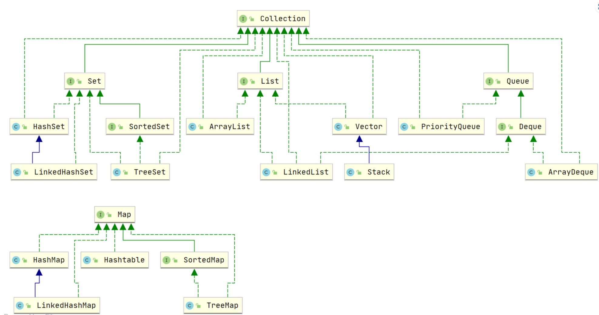

Java 集合， 也叫作容器，主要是由两大接口派生而来：一个是 `Collection`接口，主要用于存放单一元素；另一个是 `Map` 接口，主要用于存放键值对。对于`Collection` 接口，下面又有三个主要的子接口：`List`、`Set` 和 `Queue`。



# List Set Map Queue的简单介绍&区别

- `List`(对付顺序的好帮手): 存储的元素是**有序的、可重复**的。
- `Set`(注重独一无二的性质): 存储的元素是**无序的、不可重复**的。
- `Queue`(实现排队功能的叫号机): 按特定的排队规则来确定先后顺序，存储的元素是有序的、可重复的。
- `Map`(用 key 来搜索的专家): 使用键值对（key-value）存储，类似于数学上的函数 y=f(x)，"x" 代表 key，"y" 代表 value，key 是无序的、不可重复的，value 是无序的、可重复的，每个键最多映射到一个值。

## Collection接口

### List

- `ArrayList`：`Object[]` 数组
- `Vector`：`Object[]` 数组
- `LinkedList`：双向链表(JDK1.6 之前为循环链表，JDK1.7 取消了循环)

### Set

- `HashSet`(无序，唯一): 基于 `HashMap` 实现的，底层采用 `HashMap` 来保存元素
- `LinkedHashSet`: `LinkedHashSet` 是 `HashSet` 的子类，并且其内部是通过 `LinkedHashMap` 来实现的。有点类似于我们之前说的 `LinkedHashMap` 其内部是基于 `HashMap` 实现一样，不过还是有一点点区别的
- `TreeSet`(有序，唯一): 红黑树(自平衡的排序二叉树)

### Queue

- `PriorityQueue`: `Object[]` 数组来实现二叉堆
- `ArrayQueue`: `Object[]` 数组 + 双指针

## Map接口

- `HashMap`：JDK1.8 之前 `HashMap` 由数组+链表组成的，数组是 `HashMap` 的主体，链表则是主要为了解决哈希冲突而存在的（“拉链法”解决冲突）。JDK1.8 以后在解决哈希冲突时有了较大的变化，当链表长度大于阈值（默认为 8）（将链表转换成红黑树前会判断，如果当前数组的长度小于 64，那么会选择先进行数组扩容，而不是转换为红黑树）时，将链表转化为红黑树，以减少搜索时间，也就是**数组+链表+红黑树**
- `LinkedHashMap`：`LinkedHashMap` 继承自 `HashMap`，所以它的底层仍然是基于拉链式散列结构即由数组和链表或红黑树组成。另外，`LinkedHashMap` 在上面结构的基础上，增加了一条双向链表，使得上面的结构可以保持键值对的插入顺序。同时通过对链表进行相应的操作，实现了访问顺序相关逻辑。
- `Hashtable`：数组+链表组成的，数组是 `Hashtable` 的主体，链表则是主要为了解决哈希冲突而存在的
- `TreeMap`：红黑树（自平衡的排序二叉树）

# List

## ArrayList 和 Array（数组）的区别？

`ArrayList` 内部基于动态数组实现，比 `Array`（静态数组） 使用起来更加灵活：

- `ArrayList`会根据实际存储的元素动态地扩容或缩容，而 `Array` 被创建之后就不能改变它的长度了。
- `ArrayList` 允许你使用泛型来确保类型安全，`Array` 则不可以。
- `ArrayList` 中只能存储对象。对于基本类型数据，需要使用其对应的包装类（如 Integer、Double 等）。`Array` 可以直接存储基本类型数据，也可以存储对象。
- `ArrayList` 支持插入、删除、遍历等常见操作，并且提供了丰富的 API 操作方法，比如 `add()`、`remove()`等。`Array` 只是一个固定长度的数组，只能按照下标访问其中的元素，不具备动态添加、删除元素的能力。
- `ArrayList`创建时不需要指定大小，而`Array`创建时必须指定大小。

## ArrayList 和 Vector 的区别?

- `ArrayList` 是 `List` 的主要实现类，底层使用 `Object[]`存储，适用于频繁的查找工作，**线程不安全** 。
- `Vector` 是 `List` 的古老实现类，底层使用`Object[]` 存储，**线程安全**。

## Vector 和 Stack 的区别?

- `Vector` 和 `Stack` 两者都是线程安全的，都是使用 `synchronized` 关键字进行同步处理。
- `Stack` 继承自 `Vector`，是一个后进先出的栈，而 `Vector` 是一个列表。

随着 Java 并发编程的发展，`Vector` 和 `Stack` 已经被淘汰，推荐使用并发集合类（例如 `ConcurrentHashMap`、`CopyOnWriteArrayList` 等）或者手动实现线程安全的方法来提供安全的多线程操作支持。

## ArrayList 可以添加 null 值吗？

**`ArrayList` 中可以存储任何类型的对象，包括 `null` 值。**不过，不建议向`ArrayList` 中添加 `null` 值， `null` 值无意义，会让代码难以维护比如忘记做判空处理就会导致空指针异常。

## ArrayList 插入和删除元素的时间复杂度？

对于插入：

- 头部插入：由于需要将所有元素都依次向后移动一个位置，因此时间复杂度是 O(n)。
- 尾部插入：当 `ArrayList` 的容量未达到极限时，往列表末尾插入元素的时间复杂度是 O(1)，因为它只需要在数组末尾添加一个元素即可；当容量已达到极限并且需要扩容时，则需要执行一次 O(n) 的操作将原数组复制到新的更大的数组中，然后再执行 O(1) 的操作添加元素。
- 指定位置插入：需要将目标位置之后的所有元素都向后移动一个位置，然后再把新元素放入指定位置。这个过程需要移动平均 n/2 个元素，因此时间复杂度为 O(n)。

对于删除：

- 头部删除：由于需要将所有元素依次向前移动一个位置，因此时间复杂度是 O(n)。
- 尾部删除：当删除的元素位于列表末尾时，时间复杂度为 O(1)。
- 指定位置删除：需要将目标元素之后的所有元素向前移动一个位置以填补被删除的空白位置，因此需要移动平均 n/2 个元素，时间复杂度为 O(n)。

## LinkedList 插入和删除元素的时间复杂度？

- 头部插入/删除：只需要修改头结点的指针即可完成插入/删除操作，因此时间复杂度为 O(1)。
- 尾部插入/删除：只需要修改尾结点的指针即可完成插入/删除操作，因此时间复杂度为 O(1)。
- 指定位置插入/删除：需要先移动到指定位置，再修改指定节点的指针完成插入/删除，因此需要移动平均 n/2 个元素，时间复杂度为 O(n)

## LinkedList 为什么不能实现 RandomAccess 接口？

**`RandomAccess` 是一个标记接口，用来表明实现该接口的类支持随机访问（即可以通过索引快速访问元素）**。**由于 `LinkedList` 底层数据结构是链表，内存地址不连续，只能通过指针来定位，不支持随机快速访问，所以不能实现 `RandomAccess` 接口。**

## **ArrayList 与 LinkedList 区别?**

- **是否保证线程安全：** `ArrayList` 和 `LinkedList` 都是不同步的，也就是不保证线程安全；
- **底层数据结构：** `ArrayList` 底层使用的是 **`Object` 数组**；`LinkedList` 底层使用的是 **双向链表** 数据结构（JDK1.6 之前为循环链表，JDK1.7 取消了循环）
- 插入和删除是否受元素位置的影响：
  - `ArrayList` 采用数组存储，所以插入和删除元素的时间复杂度受元素位置的影响。 比如：执行`add(E e)`方法的时候， `ArrayList` 会默认在将指定的元素追加到此列表的末尾，这种情况时间复杂度就是 O(1)。但是如果要在指定位置 i 插入和删除元素的话（`add(int index, E element)`），时间复杂度就为 O(n)。因为在进行上述操作的时候集合中第 i 和第 i 个元素之后的(n-i)个元素都要执行向后位/向前移一位的操作。
  - `LinkedList` 采用链表存储，所以在头尾插入或者删除元素不受元素位置的影响（`add(E e)`、`addFirst(E e)`、`addLast(E e)`、`removeFirst()`、 `removeLast()`），时间复杂度为 O(1)，如果是要在指定位置 `i` 插入和删除元素的话（`add(int index, E element)`，`remove(Object o)`,`remove(int index)`）， 时间复杂度为 O(n) ，因为需要先移动到指定位置再插入和删除。
- **是否支持快速随机访问：** `LinkedList` 不支持高效的随机元素访问，而 `ArrayList`（实现了 `RandomAccess` 接口） 支持。快速随机访问就是通过元素的序号快速获取元素对象(对应于`get(int index)`方法)。
- **内存空间占用：** `ArrayList` 的空间浪费主要体现在在 list 列表的结尾会预留一定的容量空间，而 LinkedList 的空间花费则体现在它的每一个元素都需要消耗比 ArrayList 更多的空间（因为要存放直接后继和直接前驱以及数据）。

我们在项目中一般是不会使用到 `LinkedList` 的，需要用到 `LinkedList` 的场景几乎都可以使用 `ArrayList` 来代替，并且，性能通常会更好！就连 `LinkedList` 的作者约书亚 · 布洛克（Josh Bloch）自己都说从来不会使用 `LinkedList` 。

另外，不要下意识地认为 `LinkedList` 作为链表就最适合元素增删的场景。我在上面也说了，`LinkedList` 仅仅在头尾插入或者删除元素的时候时间复杂度近似 O(1)，其他情况增删元素的平均时间复杂度都是 O(n) 。

## RandomAccess 接口

```java
public interface RandomAccess {
}
```

查看源码我们发现实际上 `RandomAccess` 接口中什么都没有定义。所以，在我看来 `RandomAccess` 接口不过是一个标识罢了。标识什么？ 标识实现这个接口的类具有随机访问功能。

`ArrayList` 底层是数组，而 `LinkedList` 底层是链表。数组天然支持随机访问，时间复杂度为 O(1)，所以称为快速随机访问。链表需要遍历到特定位置才能访问特定位置的元素，时间复杂度为 O(n)，所以不支持快速随机访问。`ArrayList` 实现了 `RandomAccess` 接口，就表明了他具有快速随机访问功能。 `RandomAccess` 接口只是标识，并不是说 `ArrayList` 实现 `RandomAccess` 接口才具有快速随机访问功能的！

## ArrayList扩容机制

`ArrayList` 继承于 `AbstractList` ，实现了 `List`, `RandomAccess`, `Cloneable`, `java.io.Serializable` 这些接口。

```java
public class ArrayList<E> extends AbstractList<E>
        implements List<E>, RandomAccess, Cloneable, java.io.Serializable{

  }
```

- `List` : 表明它是一个列表，支持添加、删除、查找等操作，并且可以通过下标进行访问。
- `RandomAccess` ：这是一个标志接口，表明实现这个接口的 `List` 集合是支持 **快速随机访问** 的。在 `ArrayList` 中，我们即可以通过元素的序号快速获取元素对象，这就是快速随机访问。
- `Cloneable` ：表明它具有拷贝能力，可以进行深拷贝或浅拷贝操作。
- `Serializable` : 表明它可以进行序列化操作，也就是可以将对象转换为字节流进行持久化存储或网络传输，非常方便。


ArrayList是List接口的实现类，它是支持根据需要而动态增长的数组。java中标准数组是定长的，在数组被创建之后，它们不能被加长或缩短。这就意味着在创建数组时需要知道数组的所需长度，但有时我们需要动态程序中获取数组长度。ArrayList就是为此而生的,但是它不是线程安全的，外ArrayList按照插入的顺序来存放数据

- **ArrayList扩容发生在add()方法调用的时候， 调用ensureCapacityInternal()来扩容的，通过方法calculateCapacity(elementData, minCapacity)获取需要扩容的长度**
- **ensureExplicitCapacity方法可以判断是否需要扩容**
- **ArrayList扩容的关键方法grow():  获取到ArrayList中elementData数组的内存空间长度 扩容至原来的1.5倍**
- **调用Arrays.copyOf方法将elementData数组指向新的内存空间时newCapacity的连续空间 从此方法中我们可以清晰的看出其实ArrayList扩容的本质就是计算出新的扩容数组的size后实例化，并将原有数组内容复制到新数组中

## ArrayList序列化

在Java中，`transient`是一个关键字，用于修饰类的成员变量（字段）。当一个成员变量被声明为`transient`时，它将不会被默认的序列化机制所序列化。换句话说，被声明为`transient`的字段将在对象被序列化时被忽略。

elementData定义为transient的优势，自己根据size序列化真实的元素，而不是根据数组的长度序列化元素，减少了空间占用。

**ArrayList通过两个方法readObject、writeObject自定义序列化和反序列化策略，实际直接使用两个流`ObjectOutputStream`和`ObjectInputStream`来进行序列化和反序列化。**

## 快速失败(fail-fast)和安全失败(fail-safe)

**快速失败（fail—fast）**：快速失败是Java集合的一种错误检测机制

- **在用迭代器遍历一个集合对象时，如果线程A遍历过程中，线程B对集合对象的内容进行了修改（增加、删除、修改），则会抛出Concurrent Modification Exception。**
- **原理：迭代器在遍历时直接访问集合中的内容，并且在遍历过程中使用一个 ` modCount` 变量。集合在被遍历期间如果内容发生变化，就会改变`modCount`的值。每当迭代器使用hashNext()/next()遍历下一个元素之前，都会检测modCount变量是否为expectedmodCount值，是的话就返回遍历；否则抛出异常，终止遍历。**
- 注意：这里异常的抛出条件是检测到 modCount！=expectedmodCount 这个条件。如果集合发生变化时修改modCount值刚好又设置为了expectedmodCount值，则异常不会抛出。因此，不能依赖于这个异常是否抛出而进行并发操作的编程，这个异常只建议用于检测并发修改的bug。
- 场景：**java.util包下的集合类都是快速失败的，不能在多线程下发生并发修改（迭代过程中被修改），比如ArrayList 类。**

**安全失败（fail—safe）**

- **采用安全失败机制的集合容器，在遍历时不是直接在集合内容上访问的，而是先复制原有集合内容，在拷贝的集合上进行遍历。**
- 原理：由于**迭代时是对原集合的拷贝进行遍历**，所以在遍历过程中对原集合所作的修改并不能被迭代器检测到，所以不会触发Concurrent Modification Exception。
- 缺点：基于拷贝内容的优点是避免了Concurrent Modification Exception，但同样地，迭代器并不能访问到修改后的内容，即：迭代器遍历的是开始遍历那一刻拿到的集合拷贝，在遍历期间原集合发生的修改迭代器是不知道的。
- 场景：**java.util.concurrent包下的容器都是安全失败，可以在多线程下并发使用，并发修改，比如CopyOnWriteArrayList类。**

## 有哪几种实现ArrayList线程安全的方法？

fail-fast是一种可能触发的机制，实际上，ArrayList的线程安全仍然没有保证，一般，保证ArrayList的线程安全可以通过这些方案：

- 使用 Vector 代替 ArrayList。（不推荐，Vector是一个历史遗留类）
- 使用 Collections.synchronizedList 包装 ArrayList，然后操作包装后的 list。
- **使用 CopyOnWriteArrayList 代替 ArrayList。**
- 在使用 ArrayList 时，应用程序通过同步机制去控制 ArrayList 的读写。

## 补充

- java 中的 `length`属性是针对数组说的,比如说你声明了一个数组,想知道这个数组的长度则用到了 length 这个属性.
- java 中的 `length()` 方法是针对字符串说的,如果想看这个字符串的长度则用到 `length()` 这个方法.
- java 中的 `size()` 方法是针对泛型集合说的,如果想看这个泛型有多少个元素,就调用此方法来查看!


# Set

## 比较 HashSet、LinkedHashSet 和 TreeSet 三者的异同

- `HashSet`、`LinkedHashSet` 和 `TreeSet` 都是 `Set` 接口的实现类，都能保证元素唯一，并且都不是线程安全的。
- `HashSet`、`LinkedHashSet` 和 `TreeSet` 的主要区别在于底层数据结构不同。`HashSet` 的底层数据结构是哈希表（基于 `HashMap` 实现）。`LinkedHashSet` 的底层数据结构是链表和哈希表，元素的插入和取出顺序满足 FIFO。`TreeSet` 底层数据结构是红黑树，元素是有序的，排序的方式有自然排序和定制排序。
- 底层数据结构不同又导致这三者的应用场景不同。`HashSet` 用于不需要保证元素插入和取出顺序的场景，`LinkedHashSet` 用于保证元素的插入和取出顺序满足 FIFO 的场景，`TreeSet` 用于支持对元素自定义排序规则的场景。

# Comparable 和 Comparator

`Comparable` 接口和 `Comparator` 接口都是 Java 中用于排序的接口，它们在实现类对象之间比较大小、排序等方面发挥了重要作用：

- `Comparable` 接口实际上是出自`java.lang`包 它有一个 `compareTo(Object obj)`方法用来排序
- `Comparator`接口实际上是出自 `java.util` 包它有一个`compare(Object obj1, Object obj2)`方法用来排序

一般我们需要对一个集合使用自定义排序时，我们就要重写`compareTo()`方法或`compare()`方法，当我们需要对某一个集合实现两种排序方式，比如一个 `song` 对象中的歌名和歌手名分别采用一种排序方法的话，我们可以重写`compareTo()`方法和使用自制的`Comparator`方法或者以两个 `Comparator` 来实现歌名排序和歌星名排序，第二种代表我们只能使用两个参数版的 `Collections.sort()`.

```java
ArrayList<Integer> arrayList = new ArrayList<Integer>();
arrayList.add(-1);
arrayList.add(3);
arrayList.add(3);
arrayList.add(-5);
arrayList.add(7);
arrayList.add(4);
arrayList.add(-9);
arrayList.add(-7);
// void reverse(List list)：反转
Collections.reverse(arrayList);
// void sort(List list),按自然排序的升序排序
Collections.sort(arrayList);
// 定制排序的用法
Collections.sort(arrayList, new Comparator<Integer>() {
    @Override
    public int compare(Integer o1, Integer o2) {
        return o2.compareTo(o1);
    }
});
```


重写compareTo方法实现自定义类的对象排序：

```java
// String类,Integer类等已经默认实现了Comparable接口
public  class Person implements Comparable<Person> {
    private String name;
    private int age;

    public Person(String name, int age) {
        super();
        this.name = name;
        this.age = age;
    }

    public String getName() {
        return name;
    }

    public void setName(String name) {
        this.name = name;
    }

    public int getAge() {
        return age;
    }

    public void setAge(int age) {
        this.age = age;
    }

    /**
     * T重写compareTo方法实现按年龄来排序
     */
    @Override
    public int compareTo(Person o) {
        if (this.age > o.getAge()) {
            return 1;
        }
        if (this.age < o.getAge()) {
            return -1;
        }
        return 0;
    }
}

    public static void main(String[] args) {
        TreeMap<Person, String> pdata = new TreeMap<Person, String>();
        pdata.put(new Person("张三", 30), "zhangsan");
        pdata.put(new Person("李四", 20), "lisi");
        pdata.put(new Person("王五", 10), "wangwu");
        pdata.put(new Person("小红", 5), "xiaohong");
        // 得到key的值的同时得到key所对应的值
        Set<Person> keys = pdata.keySet();
        for (Person key : keys) {
            System.out.println(key.getAge() + "-" + key.getName());

        }
    }
```

# Queue

## Queue 与 Deque 的区别

`Queue` 是单端队列，只能从一端插入元素，另一端删除元素，实现上一般遵循 **先进先出（FIFO）** 规则。

`Queue` 扩展了 `Collection` 的接口，根据 **因为容量问题而导致操作失败后处理方式的不同** 可以分为两类方法: 一种在操作失败后会抛出异常，另一种则会返回特殊值。

`Deque` 是双端队列，在队列的两端均可以插入或删除元素。

`Deque` 扩展了 `Queue` 的接口, 增加了在队首和队尾进行插入和删除的方法，同样根据失败后处理方式的不同分为两类：

## ArrayDeque 与 LinkedList 的区别

`ArrayDeque` 和 `LinkedList` 都实现了 `Deque` 接口，两者都具有队列的功能，但两者有什么区别呢？

- `ArrayDeque` 是基于可变长的数组和双指针来实现，而 `LinkedList` 则通过链表来实现。
- `ArrayDeque` 不支持存储 `NULL` 数据，但 `LinkedList` 支持。
- `ArrayDeque` 是在 JDK1.6 才被引入的，而`LinkedList` 早在 JDK1.2 时就已经存在。
- `ArrayDeque` 插入时可能存在扩容过程, 不过均摊后的插入操作依然为 O(1)。虽然 `LinkedList` 不需要扩容，但是每次插入数据时均需要申请新的堆空间，均摊性能相比更慢。

从性能的角度上，选用 `ArrayDeque` 来实现队列要比 `LinkedList` 更好。此外，`ArrayDeque` 也可以用于实现栈。

## PriorityQueue

`PriorityQueue` 是在 JDK1.5 中被引入的, 其与 `Queue` 的区别在于元素出队顺序是与优先级相关的，即总是优先级最高的元素先出队。

这里列举其相关的一些要点：

- `PriorityQueue` 利用了二叉堆的数据结构来实现的，底层使用可变长的数组来存储数据
- `PriorityQueue` 通过堆元素的上浮和下沉，实现了在 O(logn) 的时间复杂度内插入元素和删除堆顶元素。
- `PriorityQueue` 是非线程安全的，且不支持存储 `NULL` 和 `non-comparable` 的对象。
- `PriorityQueue` 默认是小顶堆，但可以接收一个 `Comparator` 作为构造参数，从而来自定义元素优先级的先后。

`PriorityQueue` 在面试中可能更多的会出现在手撕算法的时候，典型例题包括堆排序、求第 K 大的数、带权图的遍历等，所以需要会熟练使用才行。

## BlockingQueue

`BlockingQueue` （阻塞队列）是一个接口，继承自 `Queue`。`BlockingQueue`阻塞的原因是其支持当队列没有元素时一直阻塞，直到有元素；还支持如果队列已满，一直等到队列可以放入新元素时再放入。

```java
public interface BlockingQueue<E> extends Queue<E> {
  // ...
}
```

`BlockingQueue` 常用于生产者-消费者模型中，生产者线程会向队列中添加数据，而消费者线程会从队列中取出数据进行处理。

### ArrayBlockingQueue 和 LinkedBlockingQueue 

# Map

## HashMap 和 Hashtable

- **线程是否安全：** `HashMap` 是非线程安全的，`Hashtable` 是线程安全的,因为 `Hashtable` 内部的方法基本都经过`synchronized` 修饰。（如果你要保证线程安全的话就使用 `ConcurrentHashMap` 吧！）；
- **效率：** 因为线程安全的问题，`HashMap` 要比 `Hashtable` 效率高一点。另外，`Hashtable` 基本被淘汰，不要在代码中使用它；
- **对 Null key 和 Null value 的支持：** **`HashMap` 可以存储 null 的 key 和 value，但 null 作为键只能有一个，null 作为值可以有多个**；Hashtable 不允许有 null 键和 null 值，否则会抛出 `NullPointerException`。
- **初始容量大小和每次扩充容量大小的不同：** ① 创建时如果不指定容量初始值，`Hashtable` 默认的初始大小为 11，之后每次扩充，容量变为原来的 2n+1。`HashMap` 默认的初始化大小为 16。之后每次扩充，容量变为原来的 2 倍。② 创建时如果给定了容量初始值，那么 `Hashtable` 会直接使用你给定的大小，而 `HashMap` 会将其扩充为 2 的幂次方大小（`HashMap` 中的`tableSizeFor()`方法保证，下面给出了源代码）。也就是说 `HashMap` 总是使用 2 的幂作为哈希表的大小,后面会介绍到为什么是 2 的幂次方。
- **底层数据结构：** JDK1.8 以后的 `HashMap` 在解决哈希冲突时有了较大的变化，**当链表长度大于阈值（默认为 8）时，将链表转化为红黑树（将链表转换成红黑树前会判断，如果当前数组的长度小于 64，那么会选择先进行数组扩容，而不是转换为红黑树**），以减少搜索时间（后文中我会结合源码对这一过程进行分析）。`Hashtable` 没有这样的机制。

## HashMap 和 HashSet

`HashSet` 底层就是基于 `HashMap` 实现的。（`HashSet` 的源码非常非常少，因为除了 `clone()`、`writeObject()`、`readObject()`是 `HashSet` 自己不得不实现之外，其他方法都是直接调用 `HashMap` 中的方法。

| `HashMap`                              | `HashSet`                                                    |
| -------------------------------------- | ------------------------------------------------------------ |
| 实现了 `Map` 接口                      | 实现 `Set` 接口                                              |
| 存储键值对                             | 仅存储对象                                                   |
| 调用 `put()`向 map 中添加元素          | 调用 `add()`方法向 `Set` 中添加元素                          |
| `HashMap` 使用键（Key）计算 `hashcode` | `HashSet` 使用成员对象来计算 `hashcode` 值，对于两个对象来说 `hashcode` 可能相同，所以`equals()`方法用来判断对象的相等性 |

## HashMap 和 TreeMap 

`TreeMap` 和`HashMap` 都继承自`AbstractMap` ，但是需要注意的是`TreeMap`它还实现了`NavigableMap`接口和`SortedMap` 接口。

实现 `NavigableMap` 接口让 `TreeMap` 有了对集合内元素的搜索的能力。

实现`SortedMap`接口让 `TreeMap` 有了对集合中的元素根据键排序的能力。默认是按 key 的升序排序，不过我们也可以指定排序的比较器。

```java
public class Person {
    private Integer age;

    public Person(Integer age) {
        this.age = age;
    }

    public Integer getAge() {
        return age;
    }


    public static void main(String[] args) {
        TreeMap<Person, String> treeMap = new TreeMap<>(new Comparator<Person>() {
            @Override
            public int compare(Person person1, Person person2) {
                return person1.age.compareTo(person2.age);
            }
        });
        treeMap.put(new Person(3), "person1");
        treeMap.put(new Person(18), "person2");
        treeMap.put(new Person(35), "person3");
        treeMap.put(new Person(16), "person4");
        treeMap.entrySet().stream().forEach(personStringEntry -> {
            System.out.println(personStringEntry.getValue());
        });
    }
}
```

**相比于`HashMap`来说 `TreeMap` 主要多了对集合中的元素根据键排序的能力以及对集合内元素的搜索的能力。**

## HashSet如何检查重复

当你把对象加入`HashSet`时，`HashSet` 会先计算对象的`hashcode`值来判断对象加入的位置，同时也会与其他加入的对象的 `hashcode` 值作比较，如果没有相符的 `hashcode`，`HashSet` 会假设对象没有重复出现。但是如果发现有相同 `hashcode` 值的对象，这时会调用`equals()`方法来检查 `hashcode` 相等的对象是否真的相同。如果两者相同，`HashSet` 就不会让加入操作成功。

## HashMap 的底层实现

JDK1.8 之前 `HashMap` 底层是 **数组和链表** 结合在一起使用也就是 **链表散列**。HashMap 通过 key 的 `hashcode` 经过扰动函数处理过后得到 hash 值，然后通过 `(n - 1) & hash` 判断当前元素存放的位置（这里的 n 指的是数组的长度），如果当前位置存在元素的话，就判断该元素与要存入的元素的 hash 值以及 key 是否相同，如果相同的话，直接覆盖，不相同就通过拉链法解决冲突。

所谓扰动函数指的就是 HashMap 的 `hash` 方法。使用 `hash` 方法也就是扰动函数是为了防止一些实现比较差的 `hashCode()` 方法 换句话说使用扰动函数之后可以减少碰撞。

JDK1.8 之后在解决哈希冲突时有了较大的变化，当链表长度大于阈值（默认为 8）（将链表转换成红黑树前会判断，如果当前数组的长度小于 64，那么会选择先进行数组扩容，而不是转换为红黑树）时，将链表转化为红黑树，以减少搜索时间。TreeMap、TreeSet 以及 JDK1.8 之后的 HashMap 底层都用到了红黑树。红黑树就是为了解决二叉查找树的缺陷，因为二叉查找树在某些情况下会退化成一个线性结构。

### 红黑树

**红黑树本质上是一种二叉查找树，为了保持平衡，它又在二叉查找树的基础上增加了一些规则**

红黑树是一种平衡的二叉树，插入、删除、查找的最坏时间复杂度都为 O(logn)，避免了二叉树最坏情况下的O(n)时间复杂度。

平衡二叉树是比红黑树更严格的平衡树，为了保持保持平衡，需要旋转的次数更多，也就是说平衡二叉树保持平衡的效率更低，所以平衡二叉树插入和删除的效率比红黑树要低。


规则如下：

1. 每个节点要么是红色，要么是黑色；
2. 根节点永远是黑色的；
3. 所有的叶子节点都是是黑色的（注意这里说叶子节点其实是图中的 NULL 节点）；
4. 每个红色节点的两个子节点一定都是黑色；
5. 从任一节点到其子树中每个叶子节点的路径都包含相同数量的黑色节点；


**红黑树有两种方式保持平衡：`旋转`和`染色`。**


## HashMap 的长度为什么是 2 的幂次方

将元素映射到table数组上面，是用hash值%数组大小，而HashMap是用**hash值&(数组大小-1)**，却能和前面达到一样的效果，这就得益于HashMap的大小是2的倍数，2的倍数意味着该数的二进制位只有一位为1，而该数-1就可以得到二进制位上1变成0，后面的0变成1，再通过&运算，就可以得到和%一样的效果，并且位运算比%的效率高得多。HashMap的容量是2的n次幂时，(n-1)的2进制也就是1111111***111这样形式的，这样与添加元素的hash值进行位运算时，能够充分的散列，使得添加的元素均匀分布在HashMap的每个位置上，减少hash碰撞。


初始化时，传的不是2的倍数时，HashMap会向上寻找`离得最近的2的倍数`，所以传入17，但HashMap的实际容量是32。

我们来看看详情，在HashMap的初始化中，有这样⼀段⽅法；

```java
public HashMap(int initialCapacity, float loadFactor) {
 ...
   this.loadFactor = loadFactor;
   this.threshold = tableSizeFor(initialCapacity);
}
```

- 阀值 threshold ，通过⽅法` tableSizeFor` 进⾏计算，是根据初始化传的参数来计算的。
- 同时，这个⽅法也要要寻找⽐初始值⼤的，最⼩的那个2进制数值。⽐如传了17，我应该找到的是32。

## 常见的哈希函数构造方法

HashMap里哈希构造函数的方法叫：

- **除留取余法**：H（key)=key%p（p<=N）,关键字除以一个不大于哈希表长度的正整数p，所得余数为地址，当然HashMap里进行了优化改造，效率更高，散列也更均衡。

其他常见的

- 直接定址法

  直接根据`key`来映射到对应的数组位置，例如1232放到下标1232的位置。

- 数字分析法

  取`key`的某些数字（例如十位和百位）作为映射的位置

- 平方取中法

  取`key`平方的中间几位作为映射的位置

## 解决哈希冲突的常见方法

HashMap使用链表的原因为了处理哈希冲突，这种方法就是所谓的：

- **链地址法**：在冲突的位置拉一个链表，把冲突的元素放进去。

还有一些常见的解决冲突的办法：

- **开放定址法**：开放定址法就是从冲突的位置再接着往下找，给冲突元素找个空位。

  找到空闲位置的方法也有很多种：

  - 线行探查法: 从冲突的位置开始，依次判断下一个位置是否空闲，直至找到空闲位置
  - 平方探查法: 从冲突的位置x开始，第一次增加`1^2`个位置，第二次增加`2^2`…，直至找到空闲的位置

- **再哈希法**：换种哈希函数，重新计算冲突元素的地址。

## HashMap的put流程

1. 首先进行哈希值的扰动，获取一个新的哈希值。`(key == null) ? 0 : (h = key.hashCode()) ^ (h >>> 16);`
2. 判断table是否位空或者长度为0，如果是则进行扩容操作。
3. 根据哈希值计算下标，如果对应小标正好没有存放数据，则直接插入即可否则需要覆盖。`tab[i = (n - 1) & hash])`
4. 判断tab[i]是否为树节点，否则向链表中插入数据，是则向树中插入节点。
5. 如果链表中插入节点的时候，链表长度大于等于8，则需要把链表转换为红黑树。`treeifyBin(tab, hash);`
6. 最后所有元素处理完成后，判断是否超过阈值；`threshold`，超过则扩容。

## HashMap的get流程

1. 使用扰动函数，获取新的哈希值
2. 计算数组下标，获取节点
3. 当前节点和key匹配，直接返回
4. 否则，当前节点是否为树节点，查找红黑树
5. 否则，遍历链表查找

## HashMap的哈希/扰动函数是怎么设计的?

HashMap的哈希函数是先拿到 key 的hashcode，是一个32位的int类型的数值，然后让hashcode的高16位和低16位进行异或操作。

```java
    static final int hash(Object key) {
        int h;
        // key的hashCode和key的hashCode右移16位做异或运算
        return (key == null) ? 0 : (h = key.hashCode()) ^ (h >>> 16);
    }
```

这么设计是为了降低哈希碰撞的概率。


 key.hashCode() 函数调用的是 key 键值类型自带的哈希函数，返回 int 型散列值。int 值范围为 **-2147483648~2147483647**，加起来大概 40 亿的映射空间。

只要哈希函数映射得比较均匀松散，一般应用是很难出现碰撞的。但问题是一个 40 亿长度的数组，内存是放不下的。

假如 HashMap 数组的初始大小才 16，就需要用之前需要对数组的长度取模运算，得到的余数才能用来访问数组下标。

源码中模运算就是把散列值和数组长度 - 1 做一个 "`与&`" 操作，位运算比取余 % 运算要快。

## 为什么HashMap链表转红黑树的阈值为8呢？

HashMap实现中，当链表长度达到一定阈值（且table长度>64）时，会将链表转换为红黑树。这个阈值在JDK8中被设置为8。 转换链表为红黑树的目的是为了在特定情况下提高HashMap的性能。红黑树相对于链表在查找、插入和删除操作上具有更好的时间复杂度，因此当链表过长时，使用红黑树可以提高这些操作的效率。

**红黑树节点的大小大概是普通节点大小的两倍，所以转红黑树，牺牲了空间换时间**，更多的是一种兜底的策略，保证极端情况下的查找效率。 阈值设置为8是根据经验和性能测试得出的一个折衷值。这个值在大多数场景下能够提供良好的性能表现。**如果链表长度小于8，链表的性能通常比较好；如果链表长度超过8，转换为红黑树可以提高性能。**


## HashMap 多线程操作导致死循环问题

JDK1.7 及之前版本的 `HashMap` 在多线程环境下扩容操作可能存在死循环问题，这是由于当一个桶位中有多个元素需要进行扩容时，多个线程同时对链表进行操作，头插法可能会导致链表中的节点指向错误的位置，从而**形成一个环形链表**，进而使得查询元素的操作陷入死循环无法结束。

为了解决这个问题，JDK1.8 版本的 HashMap 采用了尾插法而不是头插法来避免链表倒置，使得插入的节点永远都是放在链表的末尾，避免了链表中的环形结构。但是还是不建议在多线程下使用 `HashMap`，因为多线程下使用 `HashMap` 还是会存在数据覆盖的问题。并发环境下，推荐使用 `ConcurrentHashMap` 。

## HashMap 为什么线程不安全

多个键值对可能会被分配到同一个桶（bucket），并以链表或红黑树的形式存储。多个线程对 `HashMap` 的 `put` 操作会导致线程不安全，具体来说会有数据覆盖的风险。

- 两个线程 1,2 同时进行 put 操作，并且发生了哈希冲突（hash 函数计算出的插入下标是相同的）。
- 不同的线程可能在不同的时间片获得 CPU 执行的机会，当前线程 1 执行完哈希冲突判断后，由于时间片耗尽挂起。线程 2 先完成了插入操作。
- 随后，线程 1 获得时间片，由于之前已经进行过 hash 碰撞的判断，所有此时会直接进行插入，这就导致线程 2 插入的数据被线程 1 覆盖了。

还有一种情况是这两个线程同时 `put` 操作导致 `size` 的值不正确，进而导致数据覆盖的问题：

1. 线程 1 执行 `if(++size > threshold)` 判断时，假设获得 `size` 的值为 10，由于时间片耗尽挂起。
2. 线程 2 也执行 `if(++size > threshold)` 判断，获得 `size` 的值也为 10，并将元素插入到该桶位中，并将 `size` 的值更新为 11。
3. 随后，线程 1 获得时间片，它也将元素放入桶位中，并将 size 的值更新为 11。
4. 线程 1、2 都执行了一次 `put` 操作，但是 `size` 的值只增加了 1，也就导致实际上只有一个元素被添加到了 `HashMap` 中。

## HashMap的遍历方式

HashMap **遍历从大的方向来说，可分为以下 4 类**：

1. 迭代器（Iterator）方式遍历；
2. For Each 方式遍历；
3. Lambda 表达式遍历（JDK 1.8+）;
4. Streams API 遍历（JDK 1.8+）。

具体的遍历方式分为：

1. 使用迭代器（Iterator）EntrySet 的方式进行遍历；
2. 使用迭代器（Iterator）KeySet 的方式进行遍历；
3. 使用 For Each EntrySet 的方式进行遍历；
4. 使用 For Each KeySet 的方式进行遍历；
5. 使用 Lambda 表达式的方式进行遍历；
6. 使用 Streams API 单线程的方式进行遍历；
7. 使用 Streams API 多线程的方式进行遍历。

### 迭代器 EntrySet

```java
        Map<Integer, String> map = new HashMap();
        map.put(1, "Java");
        map.put(2, "JDK");
        map.put(3, "Spring Framework");
        map.put(4, "MyBatis framework");
        map.put(5, "Java中文社群");
        // 遍历
        Iterator<Map.Entry<Integer, String>> iterator = map.entrySet().iterator();
        while (iterator.hasNext()) {
            Map.Entry<Integer, String> entry = iterator.next();
            System.out.println(entry.getKey());
            System.out.println(entry.getValue());
        }
```

### 迭代器 KeySet

```java
		Map<Integer, String> map = new HashMap();
        map.put(1, "Java");
        map.put(2, "JDK");
        map.put(3, "Spring Framework");
        map.put(4, "MyBatis framework");
        map.put(5, "Java中文社群");
        // 遍历
        Iterator<Integer> iterator = map.keySet().iterator();
        while (iterator.hasNext()) {
            Integer key = iterator.next();
            System.out.println(key);
            System.out.println(map.get(key));
        }
```

### ForEach EntrySet

```java
		// 创建并赋值 HashMap
        Map<Integer, String> map = new HashMap();
        map.put(1, "Java");
        map.put(2, "JDK");
        map.put(3, "Spring Framework");
        map.put(4, "MyBatis framework");
        map.put(5, "Java中文社群");
        // 遍历
        for (Map.Entry<Integer, String> entry : map.entrySet()) {
            System.out.println(entry.getKey());
            System.out.println(entry.getValue());
        }
```

### ForEach KeySet

```java
        Map<Integer, String> map = new HashMap();
        map.put(1, "Java");
        map.put(2, "JDK");
        map.put(3, "Spring Framework");
        map.put(4, "MyBatis framework");
        map.put(5, "Java中文社群");
        // 遍历
        for (Integer key : map.keySet()) {
            System.out.println(key);
            System.out.println(map.get(key));
        }
```

### Lambda

```java
        Map<Integer, String> map = new HashMap();
        map.put(1, "Java");
        map.put(2, "JDK");
        map.put(3, "Spring Framework");
        map.put(4, "MyBatis framework");
        map.put(5, "Java中文社群");
        // 遍历
        map.forEach((key, value) -> {
            System.out.println(key);
            System.out.println(value);
        });
```

### Streams API 单线程

```java
 		// 创建并赋值 HashMap
        Map<Integer, String> map = new HashMap();
        map.put(1, "Java");
        map.put(2, "JDK");
        map.put(3, "Spring Framework");
        map.put(4, "MyBatis framework");
        map.put(5, "Java中文社群");
        
        map.entrySet().stream().forEach((entry)->{
            System.out.println(entry.getKey()+" "+entry.getValue());
        });
```

# Collections 工具类

## 排序操作

```java
void reverse(List list)//反转
void shuffle(List list)//随机排序
void sort(List list)//按自然排序的升序排序
void sort(List list, Comparator c)//定制排序，由Comparator控制排序逻辑
void swap(List list, int i , int j)//交换两个索引位置的元素
//旋转。当distance为正数时，将list后distance个元素整体移到前面。当distance为负数时，将 list的前distance个元素整体移到后面
void rotate(List list, int distance)
```

## 查找、替换操作

```
int binarySearch(List list, Object key)//对List进行二分查找，返回索引，注意List必须是有序的
int max(Collection coll)//根据元素的自然顺序，返回最大的元素。 类比int min(Collection coll)
int max(Collection coll, Comparator c)//根据定制排序，返回最大元素，排序规则由Comparatator类控制。类比int min(Collection coll, Comparator c)
void fill(List list, Object obj)//用指定的元素代替指定list中的所有元素
int frequency(Collection c, Object o)//统计元素出现次数
int indexOfSubList(List list, List target)//统计target在list中第一次出现的索引，找不到则返回-1
boolean replaceAll(List list, Object oldVal, Object newVal)//用新元素替换旧元素
```

## 同步控制

`Collections` 提供了多个`synchronizedXxx()`方法·，该方法可以将指定集合包装成线程同步的集合，从而解决多线程并发访问集合时的线程安全问题。

我们知道 `HashSet`，`TreeSet`，`ArrayList`,`LinkedList`,`HashMap`,`TreeMap` 都是线程不安全的。`Collections` 提供了多个静态方法可以把他们包装成线程同步的集合。

**最好不要用上面这些方法，效率非常低，需要线程安全的集合类型时请考虑使用 JUC 包下的并发集合。**

# 同步容器

### 同步容器（强一致性）

　同步容器指的是 Vector、Stack、HashTable及Collections类中提供的静态工厂方法创建的类。

- 其中，Vector实现了List接口，Vector实际上就是一个数组，和ArrayList类似，但是Vector中的方法都是synchronized方法，即进行了同步措施；

- Stack也是一个同步容器，它的方法也用synchronized进行了同步，它实际上是继承于Vector类；

- HashTable实现了Map接口，它和HashMap很相似，但是HashTable进行了同步处理，而HashMap没有。

　　Collections类是一个工具提供类，注意，它和Collection不同，Collection是一个顶层的接口。在Collections类中提供了大量的方法，比如对集合或者容器进行排序、查找等操作。最重要的是，在它里面提供了几个静态工厂方法来创建同步容器类。


### CopyOnWrite容器(弱一致性)

CopyOnWrite容器即**写时复制**的容器，适用于读操作远多于修改操作的并发场景中。

CopyOnWriteArrayList采用了一种读写分离的并发策略，CopyOnWriteArrayList容器允许并发读，读操作是无锁的，性能较高。至于写操作，比如向容器中添加一个元素，则首先将当前容器复制一份，然后在新副本上执行写操作，结束之后再将原容器的引用指向新容器。

- 这样做的好处是我们可以对CopyOnWrite容器进行并发的读，而不需要加锁，因为当前容器不会添加任何元素。所以CopyOnWrite容器也是一种读写分离的思想，读和写不同的容器。

  CopyOnWrite这种读写分离的思想，同时读写分离，

  在写的事务没有完成 没有提交前，是不会出现脏读问题的

　　从JDK1.5开始Java并发包里提供了两个使用CopyOnWrite机制实现的并发容器，它们是CopyOnWriteArrayList和CopyOnWriteArraySet。CopyOnWrite容器主要存在两个弱点：

- 容器对象的复制需要一定的开销，如果对象占用内存过大，可能造成频繁的MinorGC和Full GC；

- CopyOnWriteArrayList不能保证数据实时一致性，只能保证最终一致性。


### ConcurrentHashMap (弱一致性)

　　ConcurrentHashMap的弱一致性主要是为了提升效率，也是一致性与效率之间的一种权衡。要成为强一致性，就得到处使用锁，甚至是全局锁，这就与Hashtable和同步的HashMap一样了。ConcurrentHashMap的弱一致性主要体现在以下几方面：

- get操作是弱一致的：get操作只能保证一定能看到已完成的put操作

- clear操作是弱一致的：在清除完一个segments之后，正在清理下一个segments的时候，已经清理的segments可能又被加入了数据，因此clear返回的时候，ConcurrentHashMap中是可能存在数据的。

```java
public void clear() {
    for (int i = 0; i < segments.length; ++i)
        segments[i].clear();
}

```

- ConcurrentHashMap中的迭代操作是弱一致的(未遍历的内容发生变化可能会反映出来)：在遍历过程中，如果已经遍历的数组上的内容变化了，迭代器不会抛出ConcurrentModificationException异常。如果未遍历的数组上的内容发生了变化，则有可能反映到迭代过程中。
