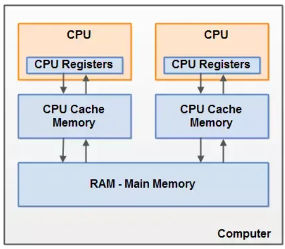
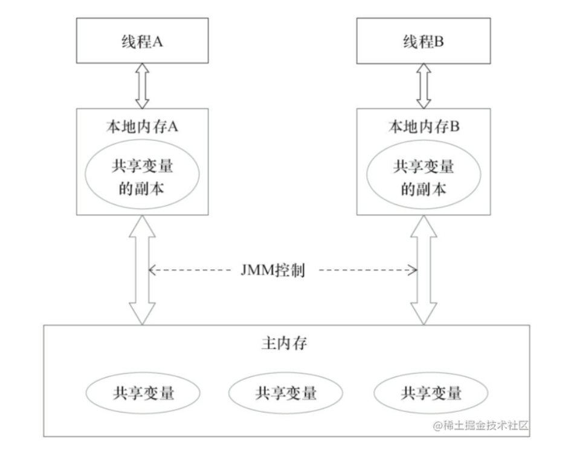
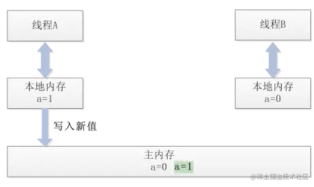
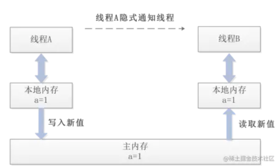

# 基本概念

## 并行-并发

- 并行就是同一时刻，两个线程都在执行。这就要求有两个CPU去分别执行两个线程。
- 并发就是同一时刻，只有一个执行，但是一个时间段内，两个线程都执行了。并发的实现依赖于CPU切换线程，因为切换的时间特别短，所以基本对于用户是无感知的。

## 并发编程

并发编程，从程序设计的角度来说，是希望通过**某些机制让计算机可以在一个时间段内，执行多个任务**。从计算机 CPU 硬件层面来说，是一个或多个物理 CPU 在多个程序之间多路复用，提高对计算机资源的利用率。从调度算法角度来说，当任务数量多于 CPU 的核数时，并发编程能够通过操作系统的任务调度算法，实现多个任务一起执行。

并发编程有三大特性：

- **原子性；**
- **可见性；**
- **有序性。**

## 进程 线程

**进程让操作系统的并发性成为了可能，而线程让进程的内部并发成为了可能。**


**多进程的方式也可以实现并发，为什么我们要使用多线程？**

多进程方式确实可以实现并发，但使用多线程，有以下几个好处：

- 进程间的通信比较复杂，而线程间的通信比较简单，通常情况下，我们需要使用共享资源，这些资源在线程间的通信比较容易。

- 进程是重量级的，而线程是轻量级的，故多线程方式的系统开销更小。


**进程和线程的区别**：

- 进程：进程是代码在数据集合上的一次运行活动，是系统进行资源分配和调度的基本单位。
- 线程：线程是进程的一个执行路径，一个进程中至少有一个线程，进程中的多个线程共享进程的资源

**操作系统在分配资源时是把资源分配给进程的， 但是 CPU 资源比较特殊，它是被分配到线程的**，因为真正要占用CPU运行的是线程，所以也说**线程是 CPU分配的基本单位**。比如在Java中，当我们启动 main 函数其实就启动了一个JVM进程，而 main 函数在的线程就是这个进程中的一个线程，也称主线程。一个进程中有多个线程，多个线程共用进程的堆和方法区资源，但是每个线程有自己的程序计数器和栈


## 上下文切换

上下文切换（有时也称做进程切换或任务切换）是指 CPU 从一个进程（或线程）切换到另一个进程（或线程）。上下文是指**某一时间点 CPU 寄存器和程序计数器的内容。**

> 寄存器是cpu内部的少量的速度很快的闪存，通常存储和访问计算过程的中间值提高计算机程序的运行速度。
>
> 程序计数器是一个专用的寄存器，用于表明指令序列中 CPU 正在执行的位置，存的值为正在执行的指令的位置或者下一个将要被执行的指令的位置，具体实现依赖于特定的系统。
>
> 举例说明 线程A - >B
>
> 1.先挂起线程A，将其在cpu中的状态保存在内存中。
>
> 2.在内存中检索下一个线程B的上下文并将其在 CPU 的寄存器中恢复,执行B线程。
>
> 3.当B执行完，根据程序计数器中指向的位置恢复线程A。

CPU通过为每个线程分配CPU时间片来实现多线程机制。CPU通过时间片分配算法来循环执行任务，当前任务执行一个时间片后会切换到下一个任务。

## 同步-异步

同步和异步通常用来形容一次方法调用。同步方法调用一开始，调用者必须等待被调用的方法结束后，调用者后面的代码才能执行。而异步调用，指的是，调用者不用管被调用方法是否完成，都会继续执行后面的代码，当被调用的方法完成后会通知调用者。比如，在超时购物，如果一件物品没了，你得等仓库人员跟你调货，直到仓库人员跟你把货物送过来，你才能继续去收银台付款，这就类似同步调用。而异步调用了，就像网购，你在网上付款下单后，什么事就不用管了，该干嘛就干嘛去了，当货物到达后你收到通知去取就好。

## 临界区

临界区用来表示一种公共资源或者说是共享数据，可以被多个线程使用。但是每个线程使用时，一旦临界区资源被一个线程占有，那么其他线程必须等待。


# 线程的创建方式

## 继承Thread类

1. 创建一个继承于Thread类的子类。
2. 重写Thread类的run()方法。
3. 创建Thread类的子类的对象。
4. 通过此对象调用start()来启动一个线程

```java
public class ThreadTest extends Thread{
    @Override
    //线程体,启动线程时会运行run()方法中的代码
    public void run() {
        //输出100以内的偶数
        for (int i = 0; i < 100; i++) {
            if (i % 2 == 0){
                System.out.println(Thread.currentThread().getName()+":\t"+i);
            }
        }
    }

    public static void main(String[] args) {
        //创建一个Thread类的子类对象
        ThreadTest t1 = new ThreadTest();
        //通过此对象调用start()启动一个线程
        t1.start();
        //注意:已经启动过一次的线程无法再次启动
        //再创建一个线程
        ThreadTest t2 = new ThreadTest();
        t2.start();

        //另一种调用方法,此方法并没有给对象命名
        new ThreadTest().start();

        System.out.println("主线程");
    }
}
```


还可以采用创建Thread匿名子类的方式

```java
new Thread(){
            @Override
            public void run() {
                for (int i = 0; i < 100; i++) {
                    if (i % 2 == 0) System.out.println(Thread.currentThread().getName() + ":\t" + i);
                }
            }
}.start();
```

## 实现Runnable接口

1. 创建一个实现Runnable接口的类。
2. 实现类去实现Runnable接口中的抽象方法：run()。
3. 创建实现类的对象。
4. 将此对象作为参数传到Thread类的构造器中，创建Thread类的对象。
5. 通过Thread类的对象调用start()方法。

```java
public class Main {
    public static void main(String[] args) {
        MyThread runnable = new MyThread();
        Thread t = new Thread(runnable);
        t.start();

        Thread t1 = new Thread(new Runnable() {
            @Override
            public void run() {
                for (int i = 0; i < 100; i++) {
                    if (i % 2 == 1) System.out.println(Thread.currentThread().getName() + ":\t" + i);
                }
            }
        });
        t1.start();
    }
}

class MyThread implements Runnable {
    @Override
    public void run() {
        for (int i = 0; i < 100; i++) {
            if (i % 2 == 0) System.out.println(Thread.currentThread().getName() + ":\t" + i);
        }
    }
}
```

## 实现Callable接口

与Runnable相比，Callable功能更强大

1. 相比run()方法，可以有返回值
2. 方法可以抛出异常
3. 支持泛型的返回值
4. 需要借助FutureTask类，比如获取返回结果

```java
public class Main {
    public static void main(String[] args) throws Exception{
        MyThread t = new MyThread();
        FutureTask<Integer> futureTask = new FutureTask<>(t);
        new Thread(futureTask).start();

        Integer e = futureTask.get();
        System.out.println(e);
    }
}

class MyThread implements Callable<Integer> {
    @Override
    public Integer call() throws Exception {
        int sum = 0;
        for (int i = 1; i < 100; i++) {
            if (i % 2 == 0) {
                System.out.println(i);
                sum += i;
            }
        }
        return sum;
    }
}
```


## 线程池的方式

```java

public class Main {
    public static void main(String[] args) throws Exception{
        //1.提供指定线程数量的线程池
        ExecutorService service = Executors.newFixedThreadPool(10);
        ThreadPoolExecutor service1 = (ThreadPoolExecutor) service;
        //设置线程池的属性
        //        System.out.println(service.getClass());
        //        service1.setCorePoolSize(15);
        //        service1.setKeepAliveTime();

        //2.执行指定的线程的操作。需要提供实现Runnable接口或Callable接口实现类的对象。
        service.execute(new NumberThread()); //适合用于Runnable
        //        service.submit(); 适合适用于Callable
        //关闭线程池
        service.shutdown();
    }
}

class NumberThread implements Runnable {
    @Override
    public void run() {
        for (int i = 0; i < 100; i++) {
            if (i % 2 == 0) {
                System.out.println(Thread.currentThread().getName() + ":\t" + i);
            }
        }
    }
}
```

# 线程的状态和基本操作

## 线程的状态及转换

- 初始状态

线程被创建，但还没有调用`start`方法

- 运行状态 

当被调用并获得处理器资源时，线程就进入了运行状态。此时，自动调用该线程对象的 run() 方法。run() 方法定义该线程的操作和功能。

- 阻塞状态 

一个正在执行的线程在某些特殊情况下，如被人为挂起或需要执行耗时的输入/输出操作，会让 CPU 暂时中止自己的执行，进入阻塞状态。

- 等待状态

当前线程需要等待其他线程做出一些特定动作

- 超时等待

不同于等待状态，可以在指定时间自行返回

- 终止状态 

线程调用 stop() 方法时或 run() 方法执行结束后，即处于死亡状态。处于死亡状态的线程不具有继续运行的能力。


线程创建之后调用`start()`方法开始运行，当调用`wait(),join(),LockSupport.lock()`方法线程会进入到**WAITING**状态，而同样的`wait(long timeout)，sleep(long),join(long),LockSupport.parkNanos(),LockSupport.parkUtil()`增加了超时等待的功能，也就是调用这些方法后线程会进入**TIMED_WAITING**状态。当超时等待时间到达后，线程会切换到**Runable**的状态，另外当**WAITING**和TIMED _WAITING状态时可以通过`Object.notify(),Object.notifyAll()`方法使线程转换到**Runable**状态。当线程出现资源竞争时，即等待获取锁的时候，线程会进入到**BLOCKED**阻塞状态，当线程获取锁时，线程进入到**Runable**状态。线程运行结束后，线程进入到**TERMINATED**状态，状态转换可以说是线程的生命周期。

*当线程进入到synchronized方法或者synchronized代码块时，线程切换到的是BLOCKED状态，而使用java.util.concurrent.locks下lock进行加锁的时候线程切换的是WAITING或者TIMED_WAITING状态，因为lock会调用LockSupport的方法。*


## 线程的`start`方法

JVM执行start方法，会先创建一条线程，由创建出来的新线程去执行thread的run方法，这才起到多线程的效果。

## 多线程join

多线程环境下，如果需要确保某一线程执行完毕后才可继续执行后续的代码，就可以通过使用 join 方法完成这一需求设计。

在项目实践中经常会遇到一个场景，就是需要等待某几件事情完成后主线程才能继续往下执行， 比如多个线程加载资源， 需要等待多个线程全部加载完毕再汇总处理。

Thread 类中有一个 join 方法就可以做这个事情，join 方法是 Thread 类直接提供的。join 是无参且返回值为 void 的方法。

假如有 3 个线程执行逻辑，线程 1 需要执行5秒钟，线程 2 需要执行10 秒钟，线程 3 需要执行 8 秒钟。 如果我们的开发需求是：必须等 3 条线程都完成执行之后再进行后续的代码处理，这时候我们就需要使用到 join 方法。

```java
public class Main {
    public static void main(String[] args) throws Exception {
        Thread thread_1 = new Thread(new Runnable() { //线程 1
            @Override
            public void run() {
                try {
                    Thread.sleep(5000); //线程 1 休眠 5 秒钟
                } catch (InterruptedException e) {
                    throw new RuntimeException(e);
                }
                System.out.println("线程 1 休眠 5 秒钟，执行完毕。");
            }
        });

        Thread thread_2 = new Thread(new Runnable() { //线程 1
            @Override
            public void run() {
                try {
                    Thread.sleep(10000); //线程 2 休眠 10 秒钟
                } catch (InterruptedException e) {
                    throw new RuntimeException(e);
                }
                System.out.println("线程 2 休眠 10 秒钟，执行完毕。");
            }
        });

        Thread thread_3 = new Thread(new Runnable() { //线程 3
            @Override
            public void run() {
                try {
                    Thread.sleep(8000); //线程 3 休眠 8 秒钟
                } catch (InterruptedException e) {
                    throw new RuntimeException(e);
                }
                System.out.println("线程 3 休眠 8 秒钟，执行完毕。");
            }
        });

        Long startTime = System.currentTimeMillis();
        thread_1.start();
        thread_2.start();
        thread_3.start();
        thread_1.join();
        thread_2.join();
        thread_3.join();
        Long endTime = System.currentTimeMillis();
        //如果没有使用join方法，计时就为0
        System.out.println(endTime-startTime);
    }
}
//线程 1 休眠 5 秒钟，执行完毕。
//线程 3 休眠 8 秒钟，执行完毕。
//线程 2 休眠 10 秒钟，执行完毕。
//10014
```

`join`方法还可以带参数，等待 millis 毫秒终止线程，假如这段时间内该线程还没执行完，也不会再继续等待。

```java
public final synchronized void join(long millis) throws InterruptedException
```

```java
thread_1.join();
thread_2.join(3000);
thread_3.join();
//线程 1 休眠 5 秒钟，执行完毕。
//线程 3 休眠 8 秒钟，执行完毕。
//8011
//线程 2 休眠 10 秒钟，执行完毕。
```


## 多线程yield

我们知道操作系统是为每个线程分配一个时间片来占有 CPU 的，正常情况下当一个线程把分配给自己的时间片使用完后，线程调度器才会进行下一轮的线程调度，这里所说的 “自己占有的时间片” 就是 CPU 分配给线程的执行权。

进一步探究，何为让出 CPU 执行权呢？

当一个线程通过某种可行的方式向操作系统提出让出 CPU 执行权时，就是在告诉线程调度器自己占有的时间片中还没有使用完的部分自己不想使用了，主动放弃剩余的时间片，并在合适的情况下，重新获取新的执行时间片。**Thread 类中有一个静态的 yield 方法，当一个线程调用 yield 方法时，实际就是在暗示线程调度器当前线程请求让出自己的 CPU 使用权。**

`yield` 方法是一个静态方法，静态方法的特点是可以由类直接进行调用，而不需要进行对象 `new` 的创建，调用方式为 `Thread.yield`


这个方法的作用就是：

暂停当前正在执行的线程对象（及放弃当前拥有的 cup 资源），并执行其他线程。`yield`  做的是让当前运行线程回到就绪状态，以允许具有相同优先级的其他线程获得运行机会。


现在有一个场景：

- 创建一个线程，线程名为 threadOne；
- 打印一个数，该数的值为从 1 加到 10000000 的和；
- 不使用 yield 方法正常执行，记录总的执行时间；
- 加入 yield 方法，再次执行程序；
- 再次记录总执行时间。

```java
public class Main {
    public static void main(String[] args) throws Exception {
        Thread thread_1 = new Thread(new NumberThread());
        thread_1.start();
        //总执行时间： 5 毫秒, 结果 count = -2004260032
    }
}

class NumberThread implements Runnable {
    @Override
    public void run() {
        Long start = System.currentTimeMillis();
        int count = 0;
        for (int i = 1; i <= 10000000; i++) {
            count = count + i;
        }
        Long end = System.currentTimeMillis();
        System.out.println("总执行时间： "+ (end-start) + " 毫秒, 结果 count = " + count);
    }
}
```

```java
public class Main {
    public static void main(String[] args) throws Exception {
        Thread thread_1 = new NumberThread();
        thread_1.start();
        //总执行时间： 4698 毫秒, 结果 count = -2004260032
    }
}

class NumberThread extends Thread {
    @Override
    public void run() {
        Long start = System.currentTimeMillis();
        int count = 0;
        for (int i = 1; i <= 10000000; i++) {
            count = count + i;
            this.yield();
        }
        Long end = System.currentTimeMillis();
        System.out.println("总执行时间： "+ (end-start) + " 毫秒, 结果 count = " + count);
    }
}
```

当加入 yield 方法执行时，线程会放弃 CPU 的执行权，并等待再次获取新的执行权，所以执行时间上会更加的长。

## 多线程sleep

`sleep` 方法是一个静态方法，静态方法的特点是可以由类直接进行调用，而不需要进行对象 `new` 的创建，调用方式为 `Thread.yield`

作用： 让当前线程进入休眠，进入“阻塞状态”，放弃占有CPU时间片，让给其它线程使用。
这行代码出现在A线程中，A线程就会进入休眠。
这行代码出现在B线程中，B线程就会进入休眠。
Thread.sleep()方法，可以做到 间隔特定的时间，去执行一段特定的代码，每隔多久执行一次。

```java
public class ThreadTest06 {
    public static void main(String[] args) {
    	//每打印一个数字睡1s
        for(int i = 0; i < 10; i++){
            System.out.println(Thread.currentThread().getName() + "--->" + i);

            // 睡眠1秒
            try {
                Thread.sleep(1000);
            } catch (InterruptedException e) {
                e.printStackTrace();
            }
        }
    }
}
```


中断`sleep`的方式是`interrupt`

```java
Thread threadA = new Thread(new Runnable() {
            @Override
            public void run() {
                //睡眠10s,再执行计算
                try {
                    Thread.sleep(10000);
                } catch (InterruptedException e) {
                    e.printStackTrace();
                }
                int sum = 0;
                for (int i = 1; i  <= 100; i++) {
                    sum = sum + i;
                }
                System.out.println("守护线程，最终求和的值为： " + sum);
            }
        });

        threadA.start();
        //主线程休眠5s
        try {
            Thread.sleep(5000);
        } catch (InterruptedException e) {
            e.printStackTrace();
        }
        //终断threadA线程的睡眠（这种终断睡眠的方式依靠了java的异常处理机制。）
        threadA.interrupt();
        System.out.println("main thread finish,jvm end");
```


## 区分yield&sleep

- sleep () 方法给其他线程运行机会时不考虑线程的优先级，因此会给低优先级的线程以运行的机会；
- yield () 方法只会给相同优先级或更高优先级的线程以运行的机会；
- 线程执行 sleep () 方法后转入阻塞 (blocked) 状态，而执行 yield () 方法后转入就绪 (ready) 状态；
- sleep () 方法声明会抛出 InterruptedException, 而 yield () 方法没有声明任何异常；
- sleep () 方法比 yield () 方法具有更好的移植性 (跟操作系统 CPU 调度相关)。


## 获得当前线程 设置优先级

```java
public class Main {
    public static void main(String[] args) throws Exception {
        Thread_my th = new Thread_my();
        new Thread(th).start();
        new Thread(th,"thread_2").start();
//Thread-0-0
//Thread-0-1
//Thread-0-2
//thread_2-0
//thread_2-1
//thread_2-2

    }
}
class Thread_my implements Runnable{
    @Override
    public void run() {
        for (int i = 0; i < 3; i++) {
            System.out.println(Thread.currentThread().getName()+"-"+i);
        }
    }
}
```


在 Java 的线程操作中，所有的线程在运行前都会保持在就绪状态，那么此时，哪个线程的优先级高，哪个线程就有可能会先被执行。

常量：
static int MAX_PRIORITY	最高优先级（10）
static int MIN_PRIORITY	最低优先级（1）
static int NORM_PRIORITY	默认优先级（5）
方法：
int getPriority()	获得线程优先级
void setPriority(int newPriority)	设置线程优先级


```java
public class Main {
    public static void main(String[] args) throws Exception {
        System.out.println("最高优先级：" + Thread.MAX_PRIORITY);//最高优先级：10
        System.out.println("最低优先级:" + Thread.MIN_PRIORITY);//最低优先级:1
        System.out.println("默认优先级:" + Thread.NORM_PRIORITY);//默认优先级:5

        // main线程的默认优先级是：5
        System.out.println(Thread.currentThread().getName() + "线程的默认优先级是：" + Thread.currentThread().getPriority());

        Thread t1 = new Thread(new Thread_my());
        t1.setName("t1");
        t1.setPriority(10);
        t1.start();
        
        for (int i = 0; i < 300; i++) {
            System.out.println(Thread.currentThread().getName()+"-"+i);
        }

    }
}
class Thread_my implements Runnable{
    @Override
    public void run() {
        for (int i = 0; i < 300; i++) {
            System.out.println(Thread.currentThread().getName()+"-"+i);
        }
    }
}
```


# 线程的上下文切换和死锁

## 概念

上下文切换：
当前线程使用完时间片后，就会处于就绪状态并让出 CPU，让其他线程占用，这就是上下文切换，从当前线程的上下文切换到了其他线程。

死锁：

两个或两个以上的线程在执行过程中，因争夺资源而造成的互相等待的现象，在无外力作用的情况下，这些线程会一直相互等待而无法继续运行下去。


线程死锁的必须要素：
互斥条件：进程要求对所分配的资源进行排他性控制，即在一段时间内某资源仅为一个进程所占有。此时若有其他进程请求该资源，则请求进程只能等待；

不可剥夺条件：进程所获得的资源在未使用完毕之前，不能被其他进程强行夺走，即只能由获得该资源的进程自己来释放（只能是主动释放，如 `yield` 释放 CPU 执行权)；

请求与保持条件：进程已经保持了至少一个资源，但又提出了新的资源请求，而该资源已被其他进程占有，此时请求进程被阻塞，但对自己已获得的资源保持不放；

循环等待条件：指在发生死锁时，必然存在一个线程请求资源的环形链，即线程集合 {T0,T1,T2,…Tn｝中的 T0 正在等待一个 T1 占用的资源，T1 正在等待 T2 占用的资源，以此类推，Tn 正在等待己被 T0 占用的资源

## 死锁的实现

创建 2 个线程，线程名分别为 threadA 和 threadB；
创建两个资源， 使用 new Object () 创建即可，分别命名为 resourceA 和 resourceB；
threadA 持有 resourceA 并申请资源 resourceB；
threadB 持有 resourceB 并申请资源 resourceA ；
为了确保发生死锁现象，我们使用 sleep 方法创造该场景；


我们首先创建了两个资源 resourceA 和 resourceB；
然后创建了两条线程 threadA 和 threadB。threadA 首先获取了 resourceA ，获取的方式是代码 synchronized (resourceA) ，然后沉睡 1000 毫秒；
在 threadA 沉睡过程中， threadB 获取了 resourceB，然后使自己沉睡 1000 毫秒；
当两个线程都苏醒时，可以确定 threadA 获取了 resourceA，threadB 获取了 resourceB，这就达到了我们做的第一步，线程分别持有自己的资源；
那么第二步就是开始申请资源，threadA 申请资源 resourceB，threadB 申请资源 resourceA ，然而 resourceA 和 resourceB 都被各自线程持有，两个线程均无法申请成功，最终达成死锁状态。

```java
public class Main {

    private static Object resourceA = new Object();//创建资源 resourceA
    private static Object resourceB = new Object();//创建资源 resourceB

    public static void main(String[] args) throws Exception {
        Thread threadA = new Thread(new Runnable() {
            @Override
            public void run() {
                synchronized (resourceA) {
                    System.out.println(Thread.currentThread().getName() + "_get A");
                    try {
                        Thread.sleep(1000);
                    } catch (InterruptedException e) {
                        e.printStackTrace();
                    }
                    System.out.println(Thread.currentThread().getName() + "_apply B");
                    synchronized (resourceB) {
                        System.out.println(Thread.currentThread().getName() + "_get B");
                    }
                }
            }
        });
        threadA.setName("threadA");

        Thread threadB = new Thread(new Runnable() {
            @Override
            public void run() {
                synchronized (resourceB) {
                    System.out.println(Thread.currentThread().getName() + "_get B");
                    try {
                        Thread.sleep(1000);
                    } catch (InterruptedException e) {
                        e.printStackTrace();
                    }
                    System.out.println(Thread.currentThread().getName() + "_apply A");
                    synchronized (resourceA) {
                        System.out.println(Thread.currentThread().getName() + "_get A");
                    }
                }
            }
        });
        threadB.setName("threadB");

        threadA.start();
        threadB.start();
    }

}
```

## 避免死锁

破坏互斥条件：该条件无法破坏，因为我们用锁本来就是想让他们互斥的（临界资源需要互斥访问)。

破坏请求与保持条件：一次性申请所有的资源。

破坏不剥夺条件：占用部分资源的线程进一步申请其他资源时，如果申请不到，可以主动释放它占有的资源。

破坏循环等待条件：靠按序申请资源来预防。按某一顺序申请资源，释放资源则反序释放。

# 守护线程 用户线程

## 定义&区别

Java 中的线程分为两类，分别为 daemon 线程（守护线程〉和 user 线程（用户线程）。
在 JVM 启动时会调用 main 函数， main 函数所在的线程就是一个用户线程，其实在 JVM 内部同时还启动了好多守护线程，比如垃圾回收线程。

守护线程定义：所谓守护线程，是指在程序运行的时候在后台提供一种通用服务的线程。比如垃圾回收线程就是一个很称职的守护者，并且这种线程并不属于程序中不可或缺的部分。

java程序的每次运行至少启动2个线程，每当使用java执行一个类时，都会启动一个JVM，每一个JVM实际上就是在操作系统中启动一个线程，Java 本身具备了垃圾的收集机制。所以在 Java 运行时至少会启动两个线程，一个是 main 线程，另外一个是垃圾收集线程。

当所有的非守护线程结束时，程序也就终止了，同时会杀死进程中的所有守护线程。反过来说，只要任何非守护线程还在运行，程序就不会终止。

用户线程定义：某种意义上的主要用户线程，只要有用户线程未执行完毕，JVM 虚拟机不会退出。

区别： 在本质上，用户线程和守护线程并没有太大区别，唯一的区别就是当最后一个非守护线程结束时，JVM 会正常退出，而不管当前是否有守护线程，也就是说守护线程是否结束并不影响 JVM 的退出。

## 守护线程

- 守护线程是运行在程序后台的线程；
- 守护线程创建的线程，依然是守护线程；
- 守护线程不会影响 JVM 的退出，当 JVM 只剩余守护线程时，JVM 进行退出；
- 守护线程在 JVM 退出时，自动销毁。

## 创建守护线程

将线程转换为守护线程可以通过调用 Thread 对象的 setDaemon (true) 方法来实现。

1. thread.setDaemon (true) 必须在 thread.start () 之前设置，否则会跑出一个 llegalThreadStateException 异常。你不能把正在运行的常规线程设置为守护线程；
2. 在 Daemon 线程中产生的新线程也是 Daemon 的；
3. 守护线程应该永远不去访问固有资源，如文件、数据库，因为它会在任何时候甚至在一个操作的中间发生中断。


```java
Thread threadA = new Thread(new Runnable() {
            @Override
            public void run() {
                System.out.println("daemon Thread");
            }
        });
threadA.setName("threadA");
threadA.setDaemon(true);
threadA.start();
```

```java
Thread threadA = new Thread(new Runnable() {
            @Override
            public void run() {
                try {
                    Thread.sleep(1000);
                } catch (InterruptedException e) {
                    e.printStackTrace();
                }
                int sum = 0;
                for (int i = 1; i  <= 100; i++) {
                    sum = sum + i;
                }
                System.out.println("守护线程，最终求和的值为： " + sum);
            }
        });

threadA.setDaemon(true);
threadA.start();

System.out.println("main thread finish,jvm end");
```

上面代码的执行结果是jvm直接退出，守护线程都没来得及执行。可以看出，VM 退出，此时不会考虑守护线程是否执行完毕，直接退出。

守护线程不决定 JVM 的退出，除非强制使用 join 方法使用户线程等待守护线程的执行结果，但是实际的开发过程中，这样的操作是不允许的，因为守护线程，默认就是不需要被用户线程等待的，是服务于用户线程的。

## 守护线程的执行场景

1. 为其它线程提供服务支持的情况，可选用守护线程；
2. 根据开发需求，程序结束时，这个线程必须正常且立刻关闭，就可以作为守护线程来使用；
3. 如果一个正在执行某个操作的线程必须要执行完毕后再释放，否则就会出现不良的后果的话，那么这个线程就不能是守护线程，而是用户线程；
4. 正常开发过程中，一般心跳监听，垃圾回收，临时数据清理等通用服务会选择守护线程。

# java内存模型

在并发编程中主要需要解决两个问题：**1. 线程之间如何通信；2.线程之间如何完成同步**（这里的线程指的是并发执行的活动实体）。通信是指线程之间以何种机制来交换信息，主要有两种：共享内存和消息传递。

java内存模型是**共享内存的并发模型**，线程之间主要通过读-写共享变量来完成隐式通信。


## 硬件内存架构

现代计算机硬件架构的简单图示：




- **多CPU**：一个现代计算机通常由两个或者多个CPU。其中一些CPU还有多核。从这一点可以看出，在一个有两个或者多个CPU的现代计算机上同时运行多个线程是可能的。每个CPU在某一时刻运行一个线程是没有问题的。这意味着，如果你的Java程序是多线程的，在你的Java程序中每个CPU上一个线程可能同时（并发）执行。
- **CPU寄存器**：每个CPU都包含一系列的寄存器，它们是CPU内内存的基础。CPU在寄存器上执行操作的速度远大于在主存上执行的速度。这是因为CPU访问寄存器的速度远大于主存。
- **高速缓存cache**：由于计算机的存储设备与处理器的运算速度之间有着几个数量级的差距，所以现代计算机系统都不得不加入一层读写速度尽可能接近处理器运算速度的高速缓存（Cache）来作为内存与处理器之间的缓冲：将运算需要使用到的数据复制到缓存中，让运算能快速进行，当运算结束后再从缓存同步回内存之中，这样处理器就无须等待缓慢的内存读写了。CPU访问缓存层的速度快于访问主存的速度，但通常比访问内部寄存器的速度还要慢一点。每个CPU可能有一个CPU缓存层，一些CPU还有多层缓存。在某一时刻，一个或者多个缓存行（cache lines）可能被读到缓存，一个或者多个缓存行可能再被刷新回主存。
- **内存**：一个计算机还包含一个主存。所有的CPU都可以访问主存。主存通常比CPU中的缓存大得多。
- **运作原理**：通常情况下，当一个CPU需要读取主存时，它会将主存的部分读到CPU缓存中。它甚至可能将缓存中的部分内容读到它的内部寄存器中，然后在寄存器中执行操作。当CPU需要将结果写回到主存中去时，它会将内部寄存器的值刷新到缓存中，然后在某个时间点将值刷新回主存。

## java内存模型抽象结构


**Java内存模型与硬件内存架构之间是存在差异的。硬件内存架构没有区分线程栈和堆。对于硬件，所有的线程栈和堆都分布在主内存中。部分线程栈和堆可能有时候会出现在CPU缓存中和CPU内部的寄存器中。**

在java程序中所有**实例域，静态域和数组元素**都是放在堆内存中（所有线程均可访问到，是可以共享的），而局部变量，方法定义参数和异常处理器参数不会在线程间共享。共享数据会出现线程安全的问题，而非共享数据不会出现线程安全的问题。


我们知道CPU的处理速度和主存的读写速度不是一个量级的，为了平衡这种巨大的差距，每个CPU都会有缓存。因此，共享变量会先放在主存中，每个线程都有属于自己的工作内存，并且会把位于主存中的共享变量拷贝到自己的工作内存，之后的读写操作均使用位于工作内存的变量副本，并在某个时刻将工作内存的变量副本写回到主存中去。JMM就从抽象层次定义了这种方式，并且JMM决定了一个线程对共享变量的写入何时对其他线程是可见的。

以下是JMM抽象示意图：



线程A和线程B之间要完成通信的话，要经历如下两步：

1. 线程A从主内存中将共享变量读入线程A的工作内存后并进行操作，之后将数据重新写回到主内存中；
2. 线程B从主存中读取最新的共享变量

从横向去看看，线程A和线程B就好像通过共享变量在进行隐式通信。这其中有很有意思的问题，如果线程A更新后数据并没有及时写回到主存，而此时线程B读到的是过期的数据，这就出现了“脏读”现象。可以通过同步机制（控制不同线程间操作发生的相对顺序）来解决或者通过`volatile`关键字使得每次`volatile`变量都能够强制刷新到主存，从而对每个线程都是可见的。


## 重排序

在不改变程序执行结果的前提下，为了尽可能提高并行度，提高性能，**编译器和处理器常常会对指令进行重排序**。一般重排序可以分为如下三种：

1. 编译器优化的重排序。编译器在不改变单线程程序语义的前提下，可以重新安排语句的执行顺序；
2. 指令级并行的重排序。现代处理器采用了指令级并行技术来将多条指令重叠执行。如果**不存在数据依赖性**，处理器可以改变语句对应机器指令的执行顺序；
3. 内存系统的重排序。由于处理器使用缓存和读/写缓冲区，这使得加载和存储操作看上去可能是在乱序执行的。

**如果两个操作访问同一个变量，且这两个操作有一个为写操作，此时这两个操作就存在数据依赖性**这里就存在三种情况：1. 读后写；2.写后写；3. 写后读，者三种操作都是存在数据依赖性的，如果重排序会对最终执行结果会存在影响。**编译器和处理器在重排序时，会遵守数据依赖性，编译器和处理器不会改变存在数据依赖性关系的两个操作的执行顺序**


**as-if-serial 语义保证在单线程环境下重排序后的执行结果不会改变。**

**happens-before 原则是判断数据是否存在竞争、线程是否安全的主要依据，保证了多线程环境下的可见性。**

### as-if-serial

有如下代码：

> double pi = 3.14 //A
>
> double r = 1.0 //B
>
> double area = pi * r * r //C

as-if-serial语义的意思是：不管怎么重排序（编译器和处理器为了提供并行度），（单线程）程序的执行结果不能被改变。

as-if-serial语义把单线程程序保护了起来，**遵守as-if-serial语义的编译器，runtime和处理器共同为编写单线程程序的程序员创建了一个幻觉：单线程程序是按程序的顺序来执行的**。比如上面计算圆面积的代码，在单线程中，会让人感觉代码是一行一行顺序执行上，实际上A,B两行不存在数据依赖性可能会进行重排序，即A，B不是顺序执行的。as-if-serial语义使程序员不必担心单线程中重排序的问题干扰他们，也无需担心内存可见性问题。

### happens-before

1）如果一个操作happens-before另一个操作，那么第一个操作的执行结果将对第二个操作可见，而且第一个操作的执行顺序排在第二个操作之前。

2）两个操作之间存在happens-before关系，并不意味着Java平台的具体实现必须要按照happens-before关系指定的顺序来执行。如果重排序之后的执行结果，与按happens-before关系来执行的结果一致，那么这种重排序并不非法（也就是说，JMM允许这种重排序）。


> **as-if-serial VS happens-before**

1. as-if-serial语义保证单线程内程序的执行结果不被改变，happens-before关系保证正确同步的多线程程序的执行结果不被改变。
2. as-if-serial语义给编写单线程程序的程序员创造了一个幻境：单线程程序是按程序的顺序来执行的。happens-before关系给编写正确同步的多线程程序的程序员创造了一个幻境：正确同步的多线程程序是按happens-before指定的顺序来执行的。
3. as-if-serial语义和happens-before这么做的目的，都是为了在不改变程序执行结果的前提下，尽可能地提高程序执行的并行度。

## JMM的设计

1. **程序员对内存模型的使用**： 程序员希望内存模型易于理解、易于编程。程序员希望基于一个强内存模型来编写代码。
2. **编译器和处理器对内存模型的实现**：编译器和处理器希望内存模型对它们的束缚越少越好，这样它们就可以做尽可能多的优化来提高性能。编译器和处理器希望实现一个弱内存模型。

JMM对能否改变程序执行结果的重排序，采用了不同的策略：

1. 对于会改变程序执行结果的重排序，JMM要求编译器和处理器必须禁止这种重排序。
2. 对于不会改变程序执行结果的重排序，JMM对编译器和处理器不做要求（JMM允许这种 重排序）

**总之：**

1. **JMM向程序员提供的happens-before规则能满足程序员的需求。JMM的happens-before规则不但简单易懂，而且也向程序员提供了足够强的内存可见性保证（有些内存可见性保证其实并不一定真实存在，比如上面的A happens-before B）。**
2. **JMM对编译器和处理器的束缚已经尽可能少。从上面的分析可以看出，JMM其实是在遵循一个基本原则：只要不改变程序的执行结果（指的是单线程程序和正确同步的多线程程序），编译器和处理器怎么优化都行。例如，如果编译器经过细致的分析后，认定一个锁只会被单个线程访问，那么这个锁可以被消除。再如，如果编译器经过细致的分析后，认定一个volatile变量只会被单个线程访问，那么编译器可以把这个volatile变量当作一个普通变量来对待。这些优化既不会改变程序的执行结果，又能提高程序的执行效率。**

# ThreadLocal

当使用 ThreadLocal 维护变量时，ThreadLocal 为每个使用该变量的线程提供独立的变量副本，所以每一个线程都可以独立地改变自己的副本，而不会影响其它线程所对应的副本。

总体概括：**从线程的角度看，目标变量就象是线程的本地变量，这也是类名中 “Local” 所要表达的意思。**


# synchronized

```java
public class SynchronizedDemo implements Runnable {
    private static int count = 0;

    public static void main(String[] args) {
        for (int i = 0; i < 10; i++) {
            Thread thread = new Thread(new SynchronizedDemo());
            thread.start();
        }
        try {
            Thread.sleep(500);
        } catch (InterruptedException e) {
            e.printStackTrace();
        }
        System.out.println("result: " + count);
    }

    @Override
    public void run() {
        for (int i = 0; i < 1000000; i++)
            count++;
    }
}
```

开启了10个线程，每个线程都累加了1000000次，如果结果正确的话自然而然总数就应该是10 * 1000000 = 10000000。可就运行多次结果都不是这个数，而且每次运行结果都不一样。

出现线程安全的主要来源于JMM的设计，主要集中在主内存和线程的工作内存而导致的**内存可见性问题**，以及**重排序导致的问题**，已经知道了**happens-before规则**。线程运行时拥有自己的栈空间，会在自己的栈空间运行，如果多线程间没有共享的数据也就是说多线程间并没有协作完成一件事情，那么，多线程就不能发挥优势，不能带来巨大的价值。那么共享数据的线程安全问题怎样处理？很自然而然的想法就是每一个线程依次去读写这个共享变量，这样就不会有任何数据安全的问题，因为每个线程所操作的都是当前最新的版本数据。那么，在java关键字synchronized就具有使每个线程依次排队操作共享变量的功能。很显然，这种同步机制效率很低，但synchronized是其他并发容器实现的基础，对它的理解也会大大提升对并发编程的感觉，从功利的角度来说，这也是面试高频的考点。


## 使用场景

synchronized是Java中的关键字，是一种同步锁。它修饰的对象有以下几种：
1. 修饰一个代码块，被修饰的代码块称为同步语句块，其作用的范围是大括号{}括起来的代码，作用的对象是调用这个代码块的对象；
2. 修饰一个方法，被修饰的方法称为同步方法，其作用的范围是整个方法，作用的对象是调用这个方法的对象；
3. 修改一个静态的方法，其作用的范围是整个静态方法，作用的对象是这个类的所有对象


### 修饰代码块

对括号里指定的对象/类加锁：

- `synchronized(object)` 表示进入同步代码库前要获得 **给定对象的锁**。
- `synchronized(类.class)` 表示进入同步代码前要获得 **给定 Class 的锁**

```java
public class Main {
    private int count = 0;
    public void play() {
        synchronized (this) {
            count++;
            System.out.println(Thread.currentThread().getName() + "  " + count);
        }
    }

    public static void main(String[] args) throws Exception {
        Main main = new Main();
        new Thread(()->{
            for (int i = 0; i < 5; i++) {
                main.play();
            }
        },"thread1").start();
        new Thread(()->{
            for (int i = 0; i < 5; i++) {
                main.play();
            }
        },"thread2").start();
    }
}
```

如果没有synchronized修饰代码块，会使得两个线程执行加法乱序，最终也会加到10，但是中间有可能出现213456这样的情况。

synchronized代码块使得每个线程都能够正确地对count变量进行操作，而且输出结果也是按照顺序递增的，这说明使用synchronized修饰的代码块确实保证了线程安全。

### 修饰实例方法

给当前对象实例加锁，进入同步代码前要获得 **当前对象实例的锁** 。

```java
public class Main {
    private int count = 0;

    public synchronized void play() {
        count++;
        System.out.println(Thread.currentThread().getName() + "  " + count);
    }

    public static void main(String[] args) throws Exception {
        Main main = new Main();
        new Thread(() -> {
            for (int i = 0; i < 5; i++) {
                main.play();
            }
        }, "thread1").start();
        new Thread(() -> {
            for (int i = 0; i < 5; i++) {
                main.play();
            }
        }, "thread2").start();
    }
}
```


### 修饰静态方法

给当前类加锁，会作用于类的所有对象实例 ，进入同步代码前要获得 **当前 class 的锁**。

这是因为静态成员不属于任何一个实例对象，归整个类所有，不依赖于类的特定实例，被类的所有实例共享。

```java
public class Main {
    private static int count = 0;

    public static synchronized void play() {
        count++;
        System.out.println(Thread.currentThread().getName() + "  " + count);
    }

    public static void main(String[] args) throws Exception {
        new Thread(() -> {
            for (int i = 0; i < 5; i++) {
                Main.play();
            }
        }, "thread1").start();
        new Thread(() -> {
            for (int i = 0; i < 5; i++) {
                Main.play();
            }
        }, "thread2").start();
    }
}
```


### 总结

- 无论synchronized关键字加在方法上还是对象上，如果它作用的对象是非静态的，则它取得的锁是对象；如果synchronized作用的对象是一个静态方法或一个类，则它取得的锁是对类，该类所有的对象同一把锁。
- 每个对象只有一个锁（lock）与之相关联，谁拿到这个锁谁就可以运行它所控制的那段代码。
- 实现同步是要很大的系统开销作为代价的，甚至可能造成死锁，所以尽量避免无谓的同步控制。
- 尽量不要使用 `synchronized(String a)` 因为 JVM 中，字符串常量池具有缓存功能。
- **构造方法不能使用 synchronized 关键字修饰。**构造方法本身就属于线程安全的，不存在同步的构造方法一说。


## 底层原理

我们使用synchronized的时候，发现不用自己去lock和unlock，是因为JVM帮我们把这个事情做了。

### 对象锁(**monitor**)机制

1. synchronized修饰代码块时，JVM采用`monitorenter`、`monitorexit`两个指令来实现同步，`monitorenter` 指令指向同步代码块的开始位置， `monitorexit` 指令则指向同步代码块的结束位置。

2. synchronized修饰同步方法时，JVM采用`ACC_SYNCHRONIZED`标记符来实现同步，这个标识指明了该方法是一个同步方法。

这就是对象锁机制帮助实现的synchronized


monitorenter、monitorexit或者ACC_SYNCHRONIZED都是**基于Monitor实现**的。

实例对象结构里有对象头，对象头里面有一块结构叫Mark Word，Mark Word指针指向了**monitor**。

所谓的Monitor其实是一种**同步工具**，也可以说是一种**同步机制**。在Java虚拟机（HotSpot）中，Monitor是由C++中的**ObjectMonitor实现**的，可以叫做内部锁，或者Monitor锁。

ObjectMonitor的工作原理：

- ObjectMonitor有两个队列：_WaitSet、_EntryList，用来保存ObjectWaiter 对象列表。
- _owner，**获取 Monitor 对象的线程进入 _owner 区时， _count + 1。如果线程调用了 wait() 方法，此时会释放 Monitor 对象， _owner 恢复为空， _count - 1。同时该等待线程进入 _WaitSet 中，等待被唤醒。**

可以发现：

- monitorenter，在判断拥有同步标识 ACC_SYNCHRONIZED 抢先进入此方法的线程会优先拥有 Monitor 的 owner ，此时计数器 +1。
- monitorexit，当执行完退出后，计数器 -1，归 0 后被其他进入的线程获得。

### Java对象头

在同步的时候是获取对象的monitor,即获取到对象的锁。那么对象的锁怎么理解？无非就是类似对对象的一个标志，那么这个标志就是存放在Java对象的对象头。Java对象头里的Mark Word里默认的存放的对象的Hashcode,分代年龄和锁标记位。32为JVM Mark Word默认存储结构为


Java SE 1.6中，锁一共有4种状态，级别从低到高依次是：**无锁状态、偏向锁状态、轻量级锁状态和重量级锁状态**，这几个状态会随着竞争情况逐渐升级。**锁可以升级但不能降级**，意味着偏向锁升级成轻量级锁后不能降级成偏向锁。这种锁升级却不能降级的策略，目的是为了提高获得锁和释放锁的效率。对象的MarkWord变化为下图：


## 锁获取和锁释放的内存语义

针对线程A的操作而言，从上图可以看出线程A会首先先从主内存中读取共享变量a=0的值然后将该变量拷贝到线程本地内存。然后基于该值进行数据操作后变量a变为1，然后会将值写入到主内存中。




线程B获取锁的时候会强制从主内存中共享变量a的值，而此时变量a已经是最新值了。接下来线程B会将该值拷贝到工作内存中进行操作，同样的执行完操作后也会重新写入到主内存中。

从横向来看，线程A和线程线程都是基于主内存中的共享变量互相感知到对方的数据操作，并基于共享变量来完成并发实体中的协同工作，整个过程就好像线程A给线程B发送了一个数据变更的“通知”，这种通信机制就是基于共享内存的并发模型结构导致。




**最大的特征就是在同一时刻只有一个线程能够获得对象monitor，从而确保当前线程能够执行到相应的同步逻辑，对线程之间而言表现为互斥性（排它性）** 


## 三大特性

> 面试时经常拿`synchronized`关键字和`volatile`关键字的特性进行对比，`synchronized`关键字可以保证并发编程的三大特性：原子性、可见性、有序性，而`volatile`关键字只能保证可见性和有序性，不能保证原子性，也称为是轻量级的`synchronized`。

- 原子性：一个或多个操作要么全部执行成功，要么全部执行失败。`synchronized`关键字可以保证只有一个线程拿到锁，访问共享资源。
- 可见性：当一个线程对共享变量进行修改后，其他线程可以立刻看到。执行`synchronized`时，会对应执行 `lock`、`unlock`原子操作，保证可见性。
- 有序性：程序的执行顺序会按照代码的先后顺序执行。

## 对synchronized的优化

因为Java虚拟机是通过进入和退出Monitor对象来实现代码块同步和方法同步的，而Monitor是依靠底层操作系统的`Mutex Lock`来实现的，操作系统实现线程之间的切换需要从用户态转换到内核态，这个切换成本比较高，对性能影响较大。

在JDK1.6之前，synchronized的实现直接调用ObjectMonitor的enter和exit，这种锁被称之为**重量级锁**。从JDK6开始，HotSpot虚拟机开发团队对Java中的锁进行优化，如增加了适应性自旋、锁消除、锁粗化、轻量级锁和偏向锁等优化策略，提升了synchronized的性能。锁的状态会随着竞争激烈逐渐升级，但通常情况下，锁的状态只能升级不能降级。这种只能升级不能降级的策略是为了提高获得锁和释放锁的效率。


### 偏向锁

引入偏向锁的目的：减少只有一个线程执行同步代码块时的性能消耗，即在没有其他线程竞争的情况下，一个线程获得了锁。

偏向锁的获取流程：

1. 检查对象头中Mark Word是否为可偏向状态，如果不是则直接升级为轻量级锁。

2. 如果是，判断Mark Work中的线程ID是否指向当前线程，如果是，则执行同步代码块。

3. 如果不是，则进行CAS操作竞争锁，如果竞争到锁，则将Mark Work中的线程ID设为当前线程ID，执行同步代码块。

4. 如果竞争失败，升级为轻量级锁。

   


只有等到竞争，持有偏向锁的线程才会撤销偏向锁。偏向锁撤销后会恢复到无锁或者轻量级锁的状态。

1. 偏向锁的撤销需要到达全局安全点，全局安全点表示一种状态，该状态下所有线程都处于暂停状态。
2. 判断锁对象是否处于无锁状态，即获得偏向锁的线程如果已经退出了临界区，表示同步代码已经执行完了。重新竞争锁的线程会进行CAS操作替代原来线程的ThreadID。
3. 如果获得偏向锁的线程还处于临界区之内，表示同步代码还未执行完，将获得偏向锁的线程升级为轻量级锁。

一句话简单总结偏向锁原理：使用CAS操作将当前线程的ID记录到对象的Mark Word中。


### 轻量级锁

引入轻量级锁的目的：在多线程交替执行同步代码块时（未发生竞争），避免使用互斥量（重量锁）带来的性能消耗。但多个线程同时进入临界区（发生竞争）则会使得轻量级锁膨胀为重量级锁。

轻量级锁即通过自旋方式不断尝试获取锁，而不是阻塞。当偏向锁被其他线程访问后，就会升级为轻量级锁。常见的轻量级锁即自旋锁

轻量级锁的进入有三种方式：

1. 对象处于未锁定 不可偏状态，此状态下对象不能进入偏向锁模式，当有线程尝试获取锁时，会通过轻量级锁的方式获取锁。
2. 当锁已经偏向于线程，且线程处于锁定状态或处于未锁定但不允许重偏向的情况下，其它的线程尝试获取锁时，会触发偏向锁撤销，然后升级为轻量级或重量级锁定。
3. 当对象已经被轻量级锁定的时候，会判断是否是锁重入，如果是重入的话，会记录一条Displaced Mark Word为空的Lock Record。如果不是重入，会膨胀为重量级锁。需要注意的是，即使膨胀为重量级锁，没有获取到锁的线程也不会马上阻塞，而是通过适应性自旋尝试获取锁，当自旋次数达到临界值后，才会阻塞未获取到的线程。JVM认为获取到锁的线程大概率会很快的释放锁，这样做是为了尽可能的避免用户态到内核态的切换。

加锁流程：
code 1 ：判断对象是否是无锁状态（低三位 = 001），如果是，执行code 2，如果不是，执行code 4。

code 2：在栈中建立一个Lock Record，将无锁状态的Mark Word拷贝到锁记录的Displaced Mark Word中，将owner指向当前对象。

code 3：尝试通过CAS 将锁对象的 Mark Word 更新为指向Lock Record的指针，如果更新成功，该线程获取到轻量级锁，并且需要把对象头的Mark Word的低两位改成10（注意这里修改的是对象头的Mark Word，Lock Record中记录的还是无锁状态的Mark Word）；如果更新失败，执行code 4。

code 4：对象是轻量级锁定状态，判断对象头的 Mark Word是否指向当前线程的栈帧。如果是，则这次为锁重入，将刚刚建立的Lock Record中的Displaced Mark Word设置为null，记录重入，该线程重入轻量级锁。如果不是，执行code 5。

code 5：线程获取轻量级锁失败，锁膨胀为重量级锁，对象头的Mark Word改为指向重量级锁monitor的指针。获取失败的线程不会立即阻塞，先适应性自旋，尝试获取锁。到达临界值后，阻塞该线程，直到被唤醒。


# 锁机制

## 乐观锁，悲观锁

悲观锁即每次去拿数据的时候都认为别人会修改，故每次拿数据的时候都会上锁。用处广泛，如数据库的行锁、表锁、读写锁等。悲观锁常见的方式为 synchronized 和 lock

乐观锁即每次去拿数据的时候都认为别人不会修改，所以不会上锁。但在更新的时候回判断一下在此期间有没有人更新了这个数据，实现方式有版本号等方式。乐观锁需要在代码上进行设计和实现，一般有两种方式：

1. 版本控制一般是在数据表上增加一个数据版本号字段(如 version)，用来表示数据修改的次数，当数据被修改时，version++。在线程A要更新数据前，先读取一次数据，获取到对应的 version，在提交更新时，会将这个 version 放入查询条件中，只有当数据库中的 version 和提交更新的 version 一致时，才会更新，成功返回 1，失败返回 0。

2. 另一种是CAS， 全称(Compare And Swap 比较和交换)，是一种无锁算法，可以在不适用锁的情况下实现多线程间变量的同步java.util.concurrent包中的原子类就是通过CAS来实现了乐观锁。

## CAS

无锁操作是使用**CAS(compare and swap)**又叫做比较交换来鉴别线程是否出现冲突，出现冲突就重试当前操作直到没有冲突为止。

### CAS操作

CAS比较交换的过程可以通俗的理解为`CAS(V,O,N)`，包含三个值分别为：**V 内存地址存放的实际值；O 预期的值（旧值）；N 更新的新值**。当V和O相同时，也就是说旧值和内存中实际的值相同表明该值没有被其他线程更改过，即该旧值O就是目前来说最新的值了，自然而然可以将新值N赋值给V。反之，V和O不相同，表明该值已经被其他线程改过了则该旧值O不是最新版本的值了，所以不能将新值N赋给V，返回V即可。当多个线程使用CAS操作一个变量时，只有一个线程会成功，并成功更新，其余会失败。失败的线程会重新尝试，当然也可以选择挂起线程

### CAS存在的问题

#### ABA问题

因为CAS会检查旧值有没有变化，这里存在这样一个有意思的问题。比如一个旧值A变为了成B，然后再变成A，刚好在做CAS时检查发现旧值并没有变化依然为A，但是实际上的确发生了变化。解决方案可以沿袭数据库中常用的乐观锁方式，添加一个版本号可以解决。原来的变化路径A->B->A就变成了1A->2B->3C。java这么优秀的语言，当然在java 1.5后的atomic包中提供了AtomicStampedReference来解决ABA问题，解决思路就是这样的。

#### 自旋时间过长

自旋CAS，如果一直循环执行，一直不成功，会给CPU带来非常大的执行开销。

在Java中，很多使用自旋CAS的地方，会有一个自旋次数的限制，超过一定次数，就停止自旋。

#### 只能保证一个共享变量的原子操作

当对一个共享变量执行操作时CAS能保证其原子性，如果对多个共享变量进行操作,CAS就不能保证其原子性。有一个解决方案是利用对象整合多个共享变量，即一个类中的成员变量就是这几个共享变量。然后将这个对象做CAS操作就可以保证其原子性。atomic中提供了AtomicReference来保证引用对象之间的原子性。


## 概述

为了让多线程安全地访问和使用共享变量，必须引入锁机制。锁机制即当一个线程持有锁后，其他线程只能进行等待，直到持有锁的线程释放锁，再次重新竞争锁。

锁大致可以分为互斥锁，共享锁以及读写锁。


**互斥锁，即只有一个线程能够访问被互斥锁保护的资源**在访问共享对象之前，对其进行加锁操作。在访问完成之后进行解锁操作。加锁后，其他试图加锁的线程会被阻塞，知道当前线程解锁。解锁后，原本等待状态的线程变为就绪状态，重新竞争锁。

**共享锁，即允许多个线程共同访问资源**

**读写锁既是互斥锁，又是共享锁。在读模式下是共享锁，写模式下是互斥锁。**也就是读读是共享的，读写是互斥的，写写互斥。


## 互斥锁

Synchronized 和 Lock 都是典型的互斥锁。

### Synchronized 和 Lock 的区别

- synchronized 是 jvm 关键字，而 lock 是 java 类
- synchronized 不用处理异常状态下的锁释放，当资源使用完毕后或连接断开时自动释放锁，而 Lock 需要显示调用释放锁
- lock 接口提供了更多可适配的类和方法，包括非公平锁、读写锁等
- jdk1.6 以前 synchronized 在大量竞争的情况下用时会迅速上升，在 jdk1.6后优化改用 CAS 实现，效率与 Lock 相差无几


### ReentrantLock 可重入锁

可重入锁是一种递归无阻塞的同步机制，也叫做递归锁，指的是同一线程在外层函数获得锁之后 ，内层递归函数仍然有获取该锁的代码，但不受影响。ReentrantLock 和 synchronized 都是可重入锁。


### 公平锁，非公平锁，中断锁


2. 

## 与`synchronized`关键字

- 悲观锁：`synchronized`关键字实现的是悲观锁，每次访问共享资源时都会上锁。
- 非公平锁：`synchronized`关键字实现的是非公平锁，即线程获取锁的顺序并不一定是按照线程阻塞的顺序。
- 可重入锁：`synchronized`关键字实现的是可重入锁，即已经获取锁的线程可以再次获取锁。
- 独占锁或者排他锁：`synchronized`关键字实现的是独占锁，即该锁只能被一个线程所持有，其他线程均被阻塞。


## 偏向锁

